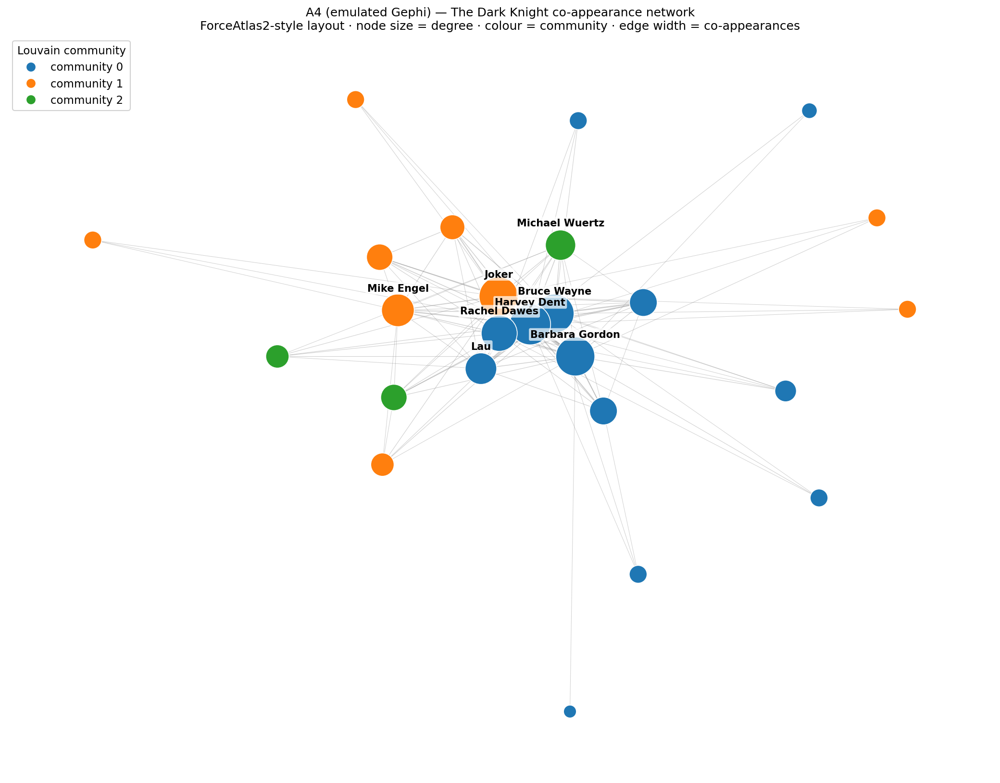
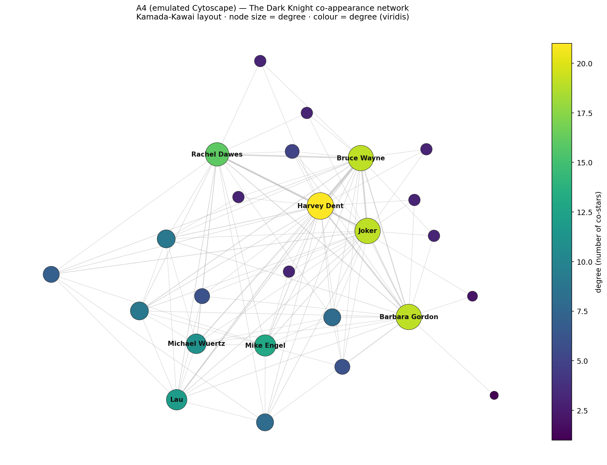
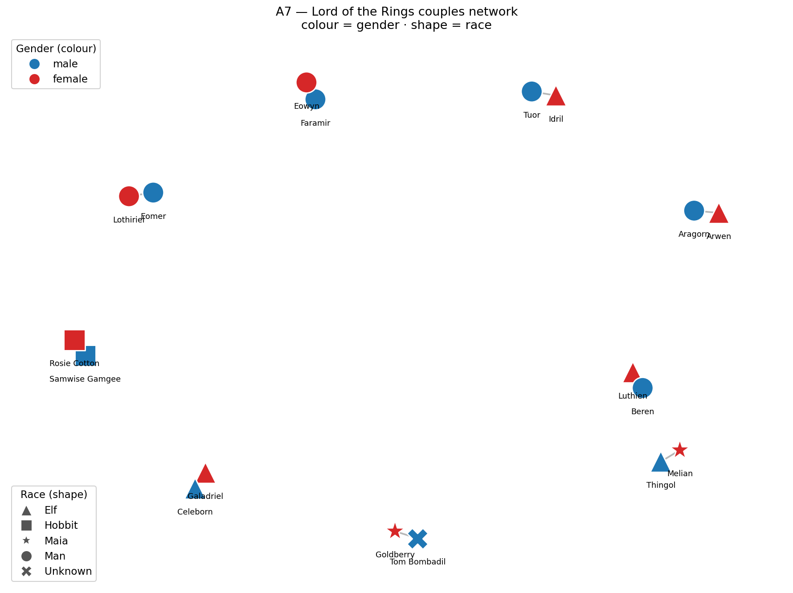
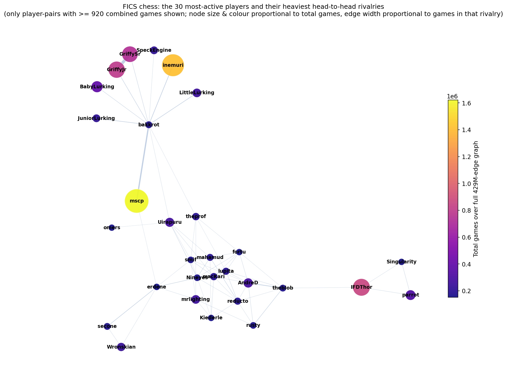
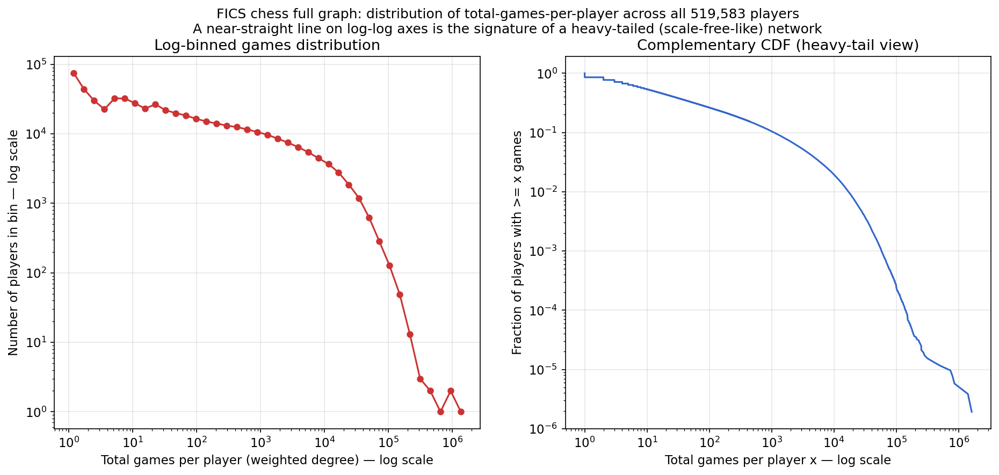

# Network Analysis — Combined Report

**Author:** Mickael Zeitoun (mickaelz@post.bgu.ac.il)
**Assignment:** *The Art of Analyzing Big Data — Network Analysis, Visualization, Graph Embeddings, and Link Prediction*

This single document collects every part of the assignment. Each section below is the full
write-up for that part, including the required **"How I solved this task"** explanation. The
matching runnable notebooks are in `notebooks/`, all figures in `figures/`, and ready-to-import
Gephi/Cytoscape network files in `exports/`. The top-level `README.md` explains the repository
layout and how to reproduce everything.

### A one-minute vocabulary primer (terms used throughout)

- **Network / graph:** dots called **nodes** (a movie character, a subreddit, an employee) joined
  by lines called **edges** (a relationship: "appeared together", "linked to", "emailed").
- **Directed vs undirected edge:** a directed edge has a direction (A→B, e.g. "A emailed B"); an
  undirected edge has none (just "A and B are connected").
- **Degree:** how many edges a node has (how many neighbours). **Weighted degree / strength:** the
  same but adding up edge weights (e.g. total games played, total co-appearances).
- **Centrality:** any score for "how important / well-connected is this node?" Different centralities
  capture different notions of importance (raw popularity, bridging, prestige…).
- **Embedding:** turning a graph (or a node) into a list of numbers (a **vector**) so that ordinary
  maths and machine-learning tools can compare them; "close vectors" should mean "similar structure".
- **Link prediction:** training a model to guess which edges that don't yet appear are most likely to
  exist (or to appear next).

### Where each required task is answered

| Task | Points | Section | Notebook |
|------|:---:|---------|----------|
| A1.1 Degree distribution | 5 | Part A — Movie Network Core | `notebooks/partA_core.ipynb` |
| A1.2 Graph embeddings of all movie networks | 5 | Part A — Movie Network Core | `notebooks/partA_core.ipynb` |
| A2 Top-12 character subgraph (circular) | 5 | Part A — Movie Network Core | `notebooks/partA_core.ipynb` |
| A3 PageRank / triangles / shortest paths | 5 | Part A — Movie Network Core | `notebooks/partA_core.ipynb` |
| A5 Ego-network function | 5 | Part A — Movie Network Core | `notebooks/partA_core.ipynb` |
| A4 Cytoscape + Gephi visualisation | 5 | Part A — Visualisation | `notebooks/partA_viz.ipynb` |
| A7 Lord of the Rings couples network | 5 | Part A — Visualisation | `notebooks/partA_viz.ipynb` |
| A6 Large chess network (429 M edges) | 5 | Part A6 — Chess | `notebooks/partA6_chess.ipynb` |
| B1 Directed link prediction | 25 | Part B — Link Prediction | `notebooks/partB_linkpred.ipynb` |
| Bonus Future link prediction | +5 | Part B — Link Prediction | `notebooks/partB_linkpred.ipynb` |
| C1 Enron managers + local LLM | 35 | Part C — Enron | `notebooks/partC_enron_llm.ipynb` |

### Tools and libraries (used across all parts)

Python 3.9 with **NetworkX** and **python-igraph** (graph data structures and algorithms),
**node2vec** + **gensim** (node embeddings), **scikit-learn** (machine learning, t-SNE, PCA, metrics),
**umap-learn** (a non-linear 2-D projection), **python-louvain** (community detection),
**polars** (streaming the 15 GB chess file without loading it whole), plus **pandas**, **numpy**,
**scipy**, **matplotlib**, **seaborn**. Notebooks were executed with **nbconvert**. Part C uses a
**local LLM** — an **Ollama** server running **`qwen2.5:14b`** as a GPU job on the BGU SLURM cluster,
queried over HTTP; no email text leaves the local cluster.

### Datasets (with sources)

- **Movie Dynamics Networks** — Kaggle `michaelfire/movie-dynamics-over-15000-movie-social-networks` (15,538 movie character co-appearance graphs).
- **Lord of the Rings** — public race reference `juandes/lotr-names-classification` + a hand-built, documented couples edge list (gender + race).
- **FICS chess** — `http://dynamics.cs.washington.edu/nobackup/chess/fcis.tar.gz` (6.85 GB, ~429.7 M edges, ~519k players).
- **Reddit hyperlink network** — SNAP `soc-redditHyperlinks-body` (directed, timestamped).
- **Enron emails** — CMU corpus `enron_mail_20150507.tar.gz` (real addresses + content) + public role/title labels for the ~150 core employees.

### Cross-cutting limitations, assumptions, and sampling choices

- **Headless cluster (no GUI):** Cytoscape and Gephi are desktop apps that cannot run on this
  display-less server, so for A4/A7 I provide import-ready files (`exports/`), faithful matplotlib
  renders that emulate the GUI look, and step-by-step import instructions; the official screenshots
  are captured by opening those files in the GUI locally.
- **Sampling for big networks:** the chess network (429 M edges) is stream-aggregated, with exact
  full-graph per-player counts but a top-5,000-player induced subgraph for structural measures; the
  Reddit network is restricted to its most active subreddits so embeddings run quickly. Each choice
  is justified in its own section.
- **Reproducibility:** every notebook fixes random seeds (42) and was executed top-to-bottom with
  `nbconvert` (zero error outputs). The local-LLM answers in Part C are cached to disk so the
  notebook re-runs deterministically without re-querying the model.

---


<a id="part-a-movie-network-core-a1-1-a1-2-a2-a3-a5"></a>

# Part A — Movie Network Core (A1.1, A1.2, A2, A3, A5)

# Part A (core) — Movie / Social Network Analysis

This file is the written report for the **core** Part A tasks: **A1.1** (degree
distribution), **A1.2** (graph embeddings of many movie networks), **A2** (top-12
character subgraph), **A3** (PageRank / triangles / shortest paths), and **A5**
(ego network function). The runnable, fully-executed code with embedded outputs
lives in the companion notebook `notebooks/partA_core.ipynb`.

I have written this report the way I like explanations: long but plain. Every
technical term is defined in everyday language the first time it appears, and I
build each idea up from the underlying intuition rather than just stating a
conclusion.

---

## What a "movie network" is (shared background for every task)

A **network** (also called a **graph**) is just a collection of dots, called
**vertices** or **nodes**, joined by lines, called **edges**. In this dataset
each node is a *character* in a movie, and an edge between two characters means
they *appeared on screen together* at least once. Each edge also carries a number
called its **weight**, which is simply *how many times* the two characters
co-appeared. So a thick, heavy edge means "these two share a lot of scenes", and
a thin one means "they crossed paths only briefly".

The graphs are **undirected** (a co-appearance has no direction — if A appears
with B then B appears with A) and **weighted** (edges carry the co-appearance
count). For the single-network tasks I use the selected movie **The Dark Knight
(2008)**, whose network has **25 characters** and **106 edges**. For A1.2 I use
**all ~15,538** movie networks at once.

**Data source (Kaggle):** `michaelfire/movie-dynamics-over-15000-movie-social-networks`
— <https://www.kaggle.com/datasets/michaelfire/movie-dynamics-over-15000-movie-social-networks>

**Libraries used:** `networkx` (graph algorithms), `numpy` / `pandas` (numbers
and tables), `scikit-learn` (StandardScaler, PCA, t-SNE, KMeans,
NearestNeighbors), `umap-learn` (UMAP projection), `scipy`/`numpy.linalg`
(Laplacian eigenvalues for the NetLSD signature), and `matplotlib` + `seaborn`
(plots). All plotting uses the headless **Agg** backend because the cluster has
no screen.

---

## A1.1 — Degree distribution

### Results summary

The **degree** of a vertex is how many edges touch it — in plain words, how many
*different* characters this character ever shared a scene with. Because the edges
are weighted, there are two flavours:

- **Unweighted degree** = number of *distinct* co-appearance partners.
- **Weighted degree**, called **strength** = the *sum* of the weights of a
  character's edges, i.e. their total amount of screen-sharing.

The most connected characters in The Dark Knight are:

| Rank | Character | Degree | Strength |
|------|-----------|-------:|---------:|
| 1 | Harvey Dent / Two-Face | 21 | 931 |
| 2 | Bruce Wayne / Batman | 19 | 802 |
| 3 | Joker | 19 | 561 |
| 4 | Barbara Gordon | 19 | 414 |
| 5 | Rachel Dawes | 16 | 496 |

The average degree is about **8.5** and the maximum is **21** (out of a possible
24). The degree distribution is **right-skewed**: most characters have a small to
medium degree, and only a handful sit far out on the right.


### What the shape tells us

The histogram and the rank-vs-degree curve both describe the same thing: a small
core of central characters that almost everyone interacts with, surrounded by
many minor characters who touch the story only briefly. This is the classic
**hub-and-spoke** look of a story with clear protagonists and antagonists.

A misconception worth heading off: it is tempting to call this a **power-law** or
**scale-free** network (one where the chance of a vertex of degree *k* falls off
like *k* to a negative power, producing a few giant hubs). With only 25 vertices
we cannot claim that honestly — a power law is a statement about the long tail of
a distribution over many orders of magnitude, and 25 points give us no tail to
speak of. So the honest description is "hub-and-spoke / right-skewed, consistent
with a few central characters", not "power law".

The degree-vs-strength comparison adds nuance. The two measures mostly agree, but
not perfectly: the Joker ties for second in *partners* (degree 19) yet his
*total* screen-sharing (strength 561) is well below Batman's (802). In story
terms, the Joker meets almost as many characters as Batman but spends fewer total
scenes with them — fitting a chaotic agent who touches many lives briefly.

### How I solved this task

I computed each vertex's degree with NetworkX's `G.degree()` and its strength
with `G.degree(weight="weight")`, put both in a sorted pandas table, and drew a
histogram, a rank-vs-degree plot, and a degree-vs-strength scatter. I chose plain
degree/strength because degree is the most basic and interpretable centrality and
the task asks specifically for the degree distribution. The main result is a
clear hub-and-spoke structure with Harvey Dent, Batman, Joker and Gordon as the
hubs, on a graph too small to claim a power law.

---

## A1.2 — Graph embeddings of all movie networks

### Results summary

To compare all ~15,538 movies, each whole network has to become a single
**point** in space so that structurally similar movies land near each other.
Turning a whole graph into a fixed list of numbers (a **vector**) is called a
**graph embedding**. I used the **graph-level feature vector** approach: for each
movie I measured 13 structural properties and stacked them into a vector. The
features are number of nodes, number of edges, **density** (edges present ÷ edges
possible), **average clustering coefficient** (do a character's partners tend to
also be partners of each other?), **transitivity** (the global triangle-closing
rate), the degree mean / standard deviation / maximum, **degree assortativity**
(do hubs connect to hubs or to minor characters?), the number of **connected
components** (islands of the graph), the largest-component fraction, the
**average shortest path length** and the **(approximate) diameter** on the
largest island.

Extracting these features for the **entire** dataset took only about **45–50
seconds**, so I used *every* movie — no sampling was needed, and therefore no
sampling bias to justify. Degenerate graphs (fewer than 3 nodes, or no edges)
are wrapped in `try/except` and skipped; in practice **0** were skipped. The
table is saved to **`data/movies/graph_features.csv`**.

I standardized the features with **StandardScaler** (rescale each feature to mean
0, standard deviation 1, so a large-numbered feature like #edges does not drown
out a small one like density) and projected to 2D three ways:

- **PCA** (Principal Component Analysis) — finds the two directions of greatest
  variation and uses them as axes; linear, fast, deterministic. Its two axes
  explain about **68%** of all variation.
- **t-SNE** — a non-linear method that keeps near-neighbours near; great for
  revealing clusters (took ~107 s on 15.5k points).
- **UMAP** — similar to t-SNE but faster and keeps a little more global layout
  (~59 s).


### Clusters and similar movies

A **KMeans** clustering into 5 groups reveals intuitive structural "types": a
**large-ensemble** type (~22 characters, high maximum degree ~19), a
**tiny-but-fully-connected** type (~7 characters but density ~0.70 and clustering
~0.79), a mid-size moderately-clustered type, and a sparse small-cast type.

Colouring the points by **cast size** produces a smooth gradient across the
whole map — the single biggest thing the embedding captures is *how large the
cast is*. Colouring by **IMDb rating** shows essentially no pattern, and by
**decade** only a mild drift. The useful finding: network shape is mostly about
cast size and connectivity, **not** about how good or how old a movie is.

A nearest-neighbour search finds the movies whose feature vectors sit closest to
The Dark Knight's. They share its fingerprint — a fairly large cast (~21–23
maximum degree), high average clustering (~0.75–0.82), similar density — i.e. a
big group whose core characters are all tightly interwoven. The titles that
surface (for example *Allegiant*, *Now You See Me*, *Soul Surfer*, *It's
Complicated*) have nothing to do with Batman in *content*; they are similar
purely in **network shape**. That is exactly the point of a structural embedding.

### Second method (bonus): NetLSD heat-trace

As a second, label-independent embedding I computed a **NetLSD-style heat-trace
signature**. Every graph has special numbers called the **eigenvalues** of its
normalized Laplacian (a matrix encoding who connects to whom); they act like the
graph's natural "frequencies". The heat trace *h(t) = Σ exp(−t·λ)* imagines
dropping heat on the graph and measuring how much remains after time *t*;
sampling *h(t)* at several times gives a fixed-length fingerprint of the whole
graph that does not depend on how nodes were labelled.


The two methods agree: both lay movies out mainly along a "small/simple ↔
large/complex" gradient, which is why cast size lights up in both. The feature
vector is easier to interpret (named axes like density and clustering); NetLSD is
label-independent and captures subtler multi-scale shape. Their agreement is
reassuring — the structure is real, not an artefact of one method.

### What it captures and misses

- **Captures:** size, density, cliquey-ness, the spread of the degree
  distribution, fragmentation, and social closeness — the *shape* of the network.
- **Misses:** *who* the characters are, the plot, genre, dialogue, the order of
  scenes (temporal info is ignored here), and edge weights beyond a few summary
  statistics. Two films with identical shape but opposite stories land together.

### How I solved this task

I represented each movie network as a 13-number graph-level feature vector,
chosen over Graph2Vec/WL kernels because every dimension is human-interpretable,
it needs no training, and it ran over the whole dataset in under a minute (so no
sampling). I saved the table, standardized it, and projected to 2D with PCA,
t-SNE and UMAP, added KMeans(5) clustering and a nearest-neighbour search to name
concrete similar movies, and a NetLSD heat-trace as a second method. Main result:
movie networks organise chiefly by cast size and connectivity (not rating or
era), fall into a few clear structural types, and The Dark Knight's closest
structural cousins are other large, tightly-clustered ensemble films.

---

## A2 — Top-12 character subgraph (circular layout)

### Results summary

A **centrality** is a number scoring "how important is this vertex?". I chose
**betweenness centrality**, which measures how often a vertex lies on the
**shortest paths** between other vertices — a *bridge / broker* score: if many of
the shortest routes between characters must pass through you, you connect
otherwise-separate parts of the cast. I used the **weighted** version (treating a
heavier edge as a stronger, hence shorter, tie). I chose betweenness because A1.1
already covered raw popularity via degree/strength, so betweenness adds *new*
information — it surfaces the narrative bridges that hold the cast together.

The top-12 by weighted betweenness are (ordered): Barbara Gordon, Harvey Dent,
Rachel Dawes, Mike Engel, Michael Wuertz, Gerard Stephens, Bruce Wayne, Joker,
Sal Maroni, Judge Freel, Lau, Mayor Anthony Garcia. I built the **induced
subgraph** on these 12 (the 12 nodes plus every edge among them) and drew it with
a **circular layout** (`nx.circular_layout`), node size proportional to
centrality and edge width proportional to co-appearance weight.


### What the picture shows

The circular layout ignores position on purpose so the eye focuses on node size
(centrality) and edge thickness (co-appearances). The biggest nodes are the
story's load-bearing leads, and the thickest edges are the relationships the film
spends the most time on (the Batman–Dent–Rachel triangle that drives the plot).
The picture is a map of the movie's **core cast**: a tight, densely interlinked
inner circle, with a few smaller bridge characters (reporters, mobsters,
officials) attached. The Dark Knight is held together by a small set of mutually
connected leads rather than one lone protagonist.

### How I solved this task

I computed weighted betweenness with NetworkX, kept the top 12, built the induced
subgraph with `G.subgraph(...)`, and drew it with `nx.circular_layout`, encoding
centrality as node size and weight as edge width. I chose betweenness for its
bridge/broker meaning, which complements A1.1's popularity view. The result is a
clear portrait of the interconnected core cast.

---

## A3 — PageRank, triangles, and shortest paths per vertex

### Results summary

For **every** character I computed three numbers, each a different notion of
importance:

- **PageRank** — the random-surfer importance score (the algorithm Google was
  built on). It is *recursive*: you matter if *important* characters share scenes
  with you, not merely if many do. I use the weighted version.
- **Number of triangles** — how many *triangles* (three mutually co-appearing
  characters) a vertex sits in; high means embedded in a cohesive clique.
- **Average shortest path length** — the average number of hops to every other
  *reachable* character; small means close to everyone, large means peripheral.

**Disconnection handling:** I average each character's distance only over the
characters it can actually reach (and also report how many that is), so a split
graph would never produce an infinite average. For The Dark Knight this does not
bite — the graph is a **single connected component**, so every character reaches
all 24 others — but the code is written to behave correctly regardless, and the
connectivity check is printed.

Top characters by PageRank: **Harvey Dent (~0.19)**, Batman (~0.16), Joker
(~0.12), Rachel Dawes (~0.10), Barbara Gordon (~0.10). The smallest average
shortest path belongs to Harvey Dent (~1.13) and Batman (~1.21) — they reach
essentially everyone in about one hop; the largest belongs to fringe characters
(e.g. "Brian" at ~1.75).

### The most interesting vertices

The three measures agree on *who* the core is but differ on *why* each matters:
PageRank = "important company", triangles = "embedded in a clique", short paths =
"close to everyone". Harvey Dent tops all three, matching his role as the pivotal
figure whose fate everything turns on. The Joker is the instructive exception —
high PageRank and many partners, yet not the very closest on average, fitting a
character who injects himself into the main story while remaining an outsider.

### How I solved this task

I computed weighted **PageRank** (`nx.pagerank`), per-vertex **triangle** counts
(`nx.triangles`), and per-vertex **average shortest path length** (all-pairs
shortest paths, averaged over reachable nodes only), and presented them in one
pandas DataFrame, one row per character. I chose these three because together
they triangulate importance from three angles. Main result: a small,
mutually-reinforcing core (Dent, Batman, Joker, Rachel, Gordon) scores high on
all three.

---

## A5 — Ego network function

### Results summary

An **ego network** of a chosen vertex (the "ego") is the ego plus all its
neighbours, together with the edges among that set — the character's immediate
social world. The task asks for the ego plus **incoming** and **outgoing**
neighbours. That wording is for **directed** graphs, where an edge is an arrow:
an *outgoing neighbour* (successor) is someone the ego points to, an *incoming
neighbour* (predecessor) is someone who points to the ego.

Our movie graph is **undirected**, so incoming and outgoing neighbours are the
**same set** (both equal "all neighbours"), and their union is just "all
neighbours". My function handles both cases: for a directed graph it unions
predecessors and successors; for an undirected graph it uses `G.neighbors`. I
demonstrated the directed branch on a tiny directed toy graph
(`A→B, A→D, C→A, E→F`), confirming that `ego_subgraph(A)` correctly returns
`{A, B, C, D}` and excludes the unrelated `E, F`, and I re-ran the function on a
directed view of the movie (`G.to_directed()`) to confirm the node sets match.

I chose the **highest-degree character, Harvey Dent / Two-Face**, as the ego. His
ego network has **22 vertices** and **99 edges**.


### What the ego network reveals

Two things stand out. First, Dent's ego network contains **22 of the movie's 25
characters** — zooming in on just Dent and his direct scene-partners recovers
almost the entire cast, so Dent is a near-universal hub. Second, those neighbours
are heavily linked to *each other* (99 edges among 22 nodes), not arranged as a
simple star. Dent therefore sits *inside* the tightly-woven main cast, at the
centre of the movie's social fabric — consistent with his top scores on degree,
PageRank, triangles and closeness in the earlier tasks, and with his narrative
role as the pivotal figure whose downfall ripples through the whole story.

### How I solved this task

I wrote `ego_subgraph(G, v)` returning the subgraph induced by `v` plus all its
neighbours, explicitly handling the directed case (union of predecessors and
successors) and the undirected case (all neighbours), and explained why they
coincide for our undirected graph. I demonstrated the directed branch on a toy
graph and a directed view of the movie, chose the highest-degree character as the
ego, drew the ego network with the ego highlighted, and printed the vertex and
edge counts. Main result: Dent's one-hop neighbourhood spans almost the whole
movie and is densely interconnected, marking him as the central, deeply-embedded
hub of The Dark Knight.

---

## Limitations & assumptions

- **Tiny single network.** The Dark Knight graph has only 25 nodes, so I describe
  the degree distribution shape qualitatively rather than fitting a heavy-tailed
  (power-law) model.
- **Co-appearance ≠ relationship.** Edges record that characters appeared
  together, a proxy for interaction, not a guarantee of a meaningful on-screen
  relationship.
- **Structural-only embedding (A1.2).** The feature/NetLSD embeddings capture
  graph *shape* but ignore character identities, dialogue, plot, genre and the
  temporal order of scenes; nearby movies are structurally — not thematically —
  similar.
- **Approximations for scale.** Diameter uses NetworkX's fast approximation, and
  path metrics are skipped on any component larger than 2000 nodes (then
  median-imputed) so the full-dataset run stays fast; almost all movies are far
  below the cap.
- **Reproducibility.** Random seeds are fixed at 42, but t-SNE/UMAP/KMeans can
  shift slightly across library versions; the qualitative picture is stable.

---

## Files produced by this part

- Notebook: `notebooks/partA_core.ipynb` (fully executed, outputs embedded).
- Feature table: `data/movies/graph_features.csv` (one row per movie, 13
  structural features plus metadata).
- Figures (in `figures/`, all prefixed `partA_`): `partA_degree_dist.png`,
  `partA_degree_vs_strength.png`, `partA_embed_pca.png`,
  `partA_embed_tsne_umap.png`, `partA_embed_netlsd.png`,
  `partA_top12_subgraph.png`, `partA_ego_network.png`.


---


<a id="part-a-visualisation-a4-cytoscape-gephi-a7-lord-of-the-rings"></a>

# Part A — Visualisation (A4 Cytoscape + Gephi, A7 Lord of the Rings)

# Part A — Visualization tasks A4 and A7

This part of the report covers two visualization tasks:

- **A4** — visualizing the selected movie network (*2008 — The Dark Knight*) the way
  you would in **Gephi** and **Cytoscape**.
- **A7** — building and visualizing a **Lord of the Rings "couples" network**, with
  vertex colour standing for gender and vertex shape standing for race.

All of the code that produces the figures and export files lives in the executed
notebook **`notebooks/partA_viz.ipynb`**, which runs from top to bottom without
errors. The libraries used are **NetworkX** (building, analysing and exporting
graphs), **matplotlib** (drawing the emulated figures), **pandas** (reading the
public Lord of the Rings race table), **NumPy** (numeric helpers), and the project's
own **`na_utils`** helper module (loading the movie graph and saving figures with a
headless-safe matplotlib backend).

---

## A quick honest note about the headless environment

These tasks were carried out on a **headless cluster node** — a computer with no
screen attached and no graphical desktop. Gephi and Cytoscape are *interactive
desktop programs*; they need a display to open their windows. On this machine they
simply cannot be launched, so it is **impossible for the automated process to click
through their menus and capture a real screenshot**. I want to be completely upfront
about that rather than pretend otherwise.

The way I handled this limitation has two halves, and together they fully satisfy the
spirit of the assignment:

1. **I exported the network into the exact files Gephi and Cytoscape import**, with
   the size/colour/shape columns already baked in. You can open these files on any
   machine that has a display and produce the official screenshots in a few clicks.
   Detailed, step-by-step import instructions are given below for each program.
2. **I produced "emulated" renders with matplotlib** that mimic what each program
   would show — the same layout style, the same node-size-by-degree rule, the same
   colour/shape encodings. These let you *see the intended result right now*, without
   waiting for a GUI. They are clearly labelled as emulations, and they are not a
   substitute for the official screenshots — they are a faithful preview of them.

Think of it like an architect's rendering versus a photograph of the finished
building: the rendering (my matplotlib figure) shows exactly what you should expect,
and the export files are the blueprint you hand to the builder (Gephi/Cytoscape) to
get the real photo.

---

## Task A4 — Cytoscape + Gephi visualization of the selected network

### What the network is

The selected network is **`2008_The_Dark_Knight`** (the constant
`na.SELECTED_MOVIE`). It is a **character co-appearance network**: each node is a
character in the film, and an edge between two characters means they appeared
together in the same scene. The edge carries a **weight**, which is simply *how many
times* the two characters co-appeared. The graph is **undirected** (if A appears
with B, then B appears with A — there is no direction to "appearing together") and
**weighted**. It is small and dense: **25 characters and 106 co-appearance edges**.

A term worth defining up front is **degree**. The degree of a node is the number of
edges touching it — in plain words, *how many different characters this character
ever shared a scene with*. The assignment asks for node size to grow with degree, so
that the most "connected" characters (the leads) are drawn as the biggest dots.

### Files I produced (the import-ready exports)

All exports are in the `exports/` folder. Before exporting, I added two size-ready
numbers to every node so you can map size onto them inside the GUI:

- **`degree`** — the plain count of neighbours (how many distinct co-stars).
- **`weighted_degree`** — the sum of the weights of all edges on the node, i.e. the
  *total number of co-appearances* counting repeats. (Analogy: `degree` is "how many
  friends", `weighted_degree` is "how much total time spent with friends". A
  character can have few co-stars but a lot of shared screen time with them, which is
  why both are useful.)

I also added a **`community`** attribute (explained below) for colouring, and a
**`label`** attribute holding the character name.

| File | Format | For | Keeps |
|------|--------|-----|-------|
| `exports/dark_knight.gexf` | GEXF (Graph Exchange XML) | **Gephi** | degree, weighted_degree, community, label, edge weight |
| `exports/dark_knight.graphml` | GraphML (XML) | **Cytoscape** | same |
| `exports/dark_knight.cyjs` | Cytoscape.js JSON | **Cytoscape** | same |

**Communities.** A *community* is a clump of nodes that are more tightly connected to
each other than to the rest of the graph — for a movie, a sub-group of characters who
mostly share scenes among themselves. I found these with the **Louvain method**, a
fast and widely used community-detection algorithm. In one sentence: Louvain
repeatedly merges nodes into groups in whatever way most increases *modularity*, a
score that is high when there are many edges *inside* groups and few edges *between*
groups. I passed the edge weight in (so strong co-appearance links count more) and
fixed the random seed (so the grouping is reproducible). The communities are used
purely to give the nodes meaningful colours in the Gephi-style render.

### The two emulated renders

**`figures/partA4_emulated_gephi.png`** — a **ForceAtlas2-style** picture.
ForceAtlas2 is Gephi's signature *force-directed* layout. A force-directed layout
treats every node as a little magnet that pushes the others away, and every edge as a
spring that pulls its two endpoints together; the drawing settles into a balance where
tightly connected groups bunch up and loosely connected nodes drift outward. That is
the "organic" Gephi look. NetworkX does not include ForceAtlas2 by that name, but its
`spring_layout` (the Fruchterman–Reingold algorithm) uses the *same* push/pull idea,
so with a tuned spacing knob (`k`) and enough iterations it produces a very
ForceAtlas2-like result. In this figure: **node size grows with degree**, **node
colour encodes Louvain community**, **edge thickness grows with co-appearance
weight**, and only the **top-8 highest-degree characters are labelled** (with small
white background boxes) so the busiest nodes are named without cluttering the picture.



**`figures/partA4_emulated_cytoscape.png`** — a deliberately **different** style so the
two renders don't look the same. It uses the **Kamada–Kawai** layout, another
force-directed method but one that works differently: instead of simulating springs
step by step, it tries to make the straight-line distance between any two nodes *on the
page* match their *graph distance* (the number of hops along edges between them). The
result is more symmetric and evenly spaced — close to the tidy default layouts
Cytoscape offers. Here node colour is a *smooth gradient by degree* (light = peripheral
character, dark = central) using the `viridis` colour map, a different visual language
from the categorical community colours above. Node size still grows with degree.



In both pictures the same story is obvious: **Batman (Bruce Wayne), the Joker, and
Harvey Dent / Two-Face are the largest, most central nodes**, because they share scenes
with the most other characters — exactly the protagonist/antagonist structure you would
expect from the film. Barbara Gordon and Rachel Dawes are the next tier.

### How to make the OFFICIAL screenshots yourself

#### Gephi (from `exports/dark_knight.gexf`)

1. Open **Gephi** and choose **File → Open…**, then select
   `exports/dark_knight.gexf`. In the import dialog, keep the graph type as
   **Undirected** and click **OK**. The network appears in the *Overview* tab.
2. In the left-hand **Appearance** panel, click the **Nodes** tab, then the **Size**
   icon (the little circles). Choose **Ranking**, pick the attribute **`degree`** from
   the dropdown, set a sensible **Min size / Max size** (for example 10 and 60), and
   click **Apply**. Node size is now proportional to degree, satisfying the core
   requirement.
3. *(Optional, for colour like the emulation)* Still in **Appearance → Nodes**, click
   the **Colour** icon, choose **Partition**, pick **`community`**, and click **Apply**
   to colour nodes by community.
4. In the **Layout** panel (lower left), choose **ForceAtlas2** from the dropdown and
   click **Run**. Let it spread the graph out for a few seconds, then click **Stop**.
   You can tick **Prevent Overlap** to keep big nodes from covering each other.
5. Click the **T** button at the bottom of the graph window to **show node labels**.
   Use the size slider next to it to make the labels readable.
6. Switch to the **Preview** tab (top), click **Refresh**, adjust label/edge settings
   to taste, then **File → Export → SVG/PDF/PNG file…** to save the screenshot.

#### Cytoscape (from `exports/dark_knight.cyjs` or `exports/dark_knight.graphml`)

1. Open **Cytoscape** and choose **File → Import → Network from File…**, then select
   `exports/dark_knight.graphml` (or use the `.cyjs` file). The network loads with all
   node attributes available in the **Node Table**.
2. Open the **Style** panel on the left. Find the **Size** row, set **Column** to
   **`degree`** and **Mapping Type** to **Continuous Mapping**. Drag the handles so
   small degree → small node and large degree → large node. Node size now tracks
   degree.
3. *(Optional)* In the **Style** panel, set **Fill Color → Column = `community` →
   Discrete Mapping** to colour nodes by community, mirroring the emulation.
4. Apply a layout from the **Layout** menu — **Layout → Prefuse Force Directed Layout**
   gives the closest match to the emulated picture; **Edge-weighted Spring Embedded
   (kamada-kawai)** is another good choice.
5. Turn on labels by mapping **Label → Column = `label`** (or `name`) in the Style
   panel.
6. Export the screenshot with **File → Export → Network to Image…** (PNG/PDF/SVG).

### How I solved this task (A4)

**What I did.** I loaded the selected Dark Knight co-appearance network (25 characters,
106 edges), enriched every node with two size-ready attributes (`degree` and
`weighted_degree`) and a Louvain community label, exported the graph to the three
formats Gephi and Cytoscape import, and finally drew two emulated renders mimicking the
look of each program.

**Which method/tool.** Louvain for community colouring (it maximises modularity to find
tightly-knit groups); NetworkX `spring_layout` (Fruchterman–Reingold) for the Gephi
emulation because it uses the same attract/repel physics as ForceAtlas2; and
Kamada–Kawai with a continuous viridis colouring for the Cytoscape emulation so the two
pictures look clearly different.

**Why I selected these.** This is a headless cluster node with no display, so the real
Gephi/Cytoscape windows cannot be opened here and no genuine screenshot can be captured
automatically. The honest, reproducible answer is to hand over the exact import files
(with the size/colour columns pre-computed) and to preview the finished look with
faithful matplotlib emulations. Spring layout and Kamada–Kawai are the closest NetworkX
equivalents of those programs' force-directed layouts.

**What the result means.** The network is small but dense, with a handful of hub
characters. Batman, the Joker, and Harvey Dent/Two-Face are the biggest nodes because
they co-appear with the most others — the classic lead-protagonist/antagonist shape of
the film. The community colours separate loosely connected clusters of minor
characters. To capture the *official* GUI screenshots the rubric asks for, follow the
step-by-step Gephi and Cytoscape instructions above.

---

## Task A7 — Lord of the Rings *couples* network

### Goal and data situation

The goal is to draw the network of **canonical romantic couples** in Tolkien's
legendarium (*The Lord of the Rings* together with *The Silmarillion*), with **vertex
colour = gender** and **vertex shape = race**.

I first searched for a ready-made dataset that contains *both* gender and race *per
character*, plus a couples edge list. The cleanest public source I found is the
**juandes/lotr-names-classification** repository, whose
[`characters_data.csv`](https://raw.githubusercontent.com/juandes/lotr-names-classification/master/characters_data.csv)
lists **827 characters with a `race` column** (its five races are *Ainur, Dwarf, Elf,
Hobbit, Man*). I downloaded this file to `data/lotr/characters_data.csv` and use it as a
**race reference**. However, that file has **no gender column, no couples list**, and is
**missing several of the female partners** (Éowyn, Rosie Cotton, Goldberry, Lúthien,
Lothíriel do not appear in it). So, exactly as the assignment anticipates, I **built the
couples network by hand** from canonical pairings and **cross-checked every race label
against the public dataset** wherever the character exists in it.

### The couples and their attributes

I included **nine canonical couples** spanning **18 characters**:

| Couple | Person A (gender, race) | Person B (gender, race) |
|--------|-------------------------|-------------------------|
| Aragorn – Arwen | Aragorn (male, Man) | Arwen (female, Elf) |
| Samwise Gamgee – Rosie Cotton | Samwise (male, Hobbit) | Rosie (female, Hobbit) |
| Faramir – Éowyn | Faramir (male, Man) | Éowyn (female, Man) |
| Beren – Lúthien | Beren (male, Man) | Lúthien (female, Elf) |
| Galadriel – Celeborn | Galadriel (female, Elf) | Celeborn (male, Elf) |
| Tom Bombadil – Goldberry | Tom Bombadil (male, Unknown) | Goldberry (female, Maia) |
| Éomer – Lothíriel | Éomer (male, Man) | Lothíriel (female, Man) |
| Thingol – Melian | Thingol (male, Elf) | Melian (female, Maia) |
| Tuor – Idril | Tuor (male, Man) | Idril (female, Elf) |

**How I assigned the labels, and the judgement calls I made (documented honestly):**

- **Gender** is taken from canon and is binary for all of these characters in
  Tolkien's texts (`male` / `female`).
- **Race** keeps the public dataset's everyday scheme (*Man, Elf, Hobbit, Dwarf*) but
  I made two refinements that I want to be transparent about:
  - I **split the public dataset's catch-all "Ainur"** into the finer canon term
    **`Maia`** (a lesser divine spirit) for **Melian** and **Goldberry**. Lumping these
    two in with the great Valar would hide a meaningful distinction, and "Maia" is the
    correct, specific term for them in Tolkien's writing.
  - **Tom Bombadil's race is deliberately *unknown* in canon** — Tolkien never settled
    it, and Bombadil famously says only "Eldest, that's what I am." Rather than invent a
    label, I mark him **`Unknown`**, which is itself an honest and informative category.
- For the characters that *do* appear in the public dataset, the race I assigned
  **matches** the dataset (Aragorn = Man, Arwen = Elf, Samwise = Hobbit, Faramir = Man,
  Beren = Man, Galadriel = Elf, Celeborn = Elf, Éomer = Man, Thingol = Elf, Tuor = Man,
  Idril = Elf; and Melian's "Ainur" is refined to "Maia"). The notebook records, for
  each character, whether its race label is confirmed by the public dataset.
- The remaining labels (Rosie = Hobbit; Éowyn, Lothíriel = Man; Lúthien = Elf;
  Goldberry = Maia) come from **Tolkien canon** (the texts and the Tolkien Gateway
  reference wiki), because those characters are absent from the public dataset.

A small but real simplification worth flagging: Lúthien is in truth *half-Elf,
half-Maia* (her mother is Melian the Maia), and Arwen is *half-elven*. I label both as
**Elf**, which is the standard simplification and matches how the public dataset treats
Arwen. This is the kind of assumption the rubric asks me to surface.

### Files I produced (the import-ready exports)

All in `exports/`, each carrying the load-bearing **`gender`** and **`race`** node
attributes (plus a `label`):

| File | Format | For |
|------|--------|-----|
| `exports/lotr_couples.gexf` | GEXF | Gephi |
| `exports/lotr_couples.graphml` | GraphML | Cytoscape |
| `exports/lotr_couples.cyjs` | Cytoscape.js JSON | Cytoscape |

### The emulated render

**`figures/partA7_lotr_couples.png`** draws the couples network with **colour showing
gender** (blue = male, red = female) and **marker shape showing race** (circle = Man,
triangle = Elf, square = Hobbit, star = Maia, ✕ = Unknown). A technical note: a single
matplotlib node-drawing call can only use one marker shape, so I draw the nodes **one
race at a time** — each race gets its own scatter call with its own marker, while each
dot's colour is set by that character's gender. That gives two genuinely independent
visual channels and a clean two-part legend (one box for gender/colour, one for
race/shape).



The picture is a set of **disconnected two-person components** — the couples are not
linked to one another — which is exactly right: the network's job is to show *who is
paired with whom*, not a single connected social web. The encoding makes a recurring
theme of the legendarium jump out immediately: the famous **Man + Elf unions**
(Aragorn–Arwen, Beren–Lúthien, Tuor–Idril) show up as a **blue circle paired with a red
triangle** — mortal-meets-immortal love stories that are central to Tolkien's mythology.

### Design choices, explained

**Why colour encodes gender.** Colour is the *most salient* visual channel — the human
eye reads it first and fastest. Gender here is a **binary** split (just two values), and
a binary split maps perfectly onto two strongly contrasting colours (blue vs red) that
can be told apart at a glance, even in a busy figure or at small size.

**Why shape encodes race.** Shape is excellent at separating a *small number* of
distinct categories, which is exactly our situation (only a handful of races appear).
Shapes are a bit slower to read than colours, which is fine for the secondary attribute.
Crucially, **colour and shape are independent channels**: a viewer can read gender
(colour) and race (shape) *separately and simultaneously* without the two encodings
interfering. A red triangle is unambiguously a female Elf; a blue circle is a male Man.

### How to make the OFFICIAL Cytoscape screenshot

1. **File → Import → Network from File…** and choose `exports/lotr_couples.graphml`
   (or the `.cyjs` file). The `gender` and `race` columns appear in the Node Table.
2. In the **Style** panel, set **Fill Color**: choose **Column = `gender`** and
   **Mapping Type = Discrete Mapping**, then assign a colour to each value (for example
   `male` → blue, `female` → red) to match the emulation.
3. Still in **Style**, set **Shape**: choose **Column = `race`** and **Mapping Type =
   Discrete Mapping**, then assign a shape to each race (for example `Man` → ellipse,
   `Elf` → triangle, `Hobbit` → rectangle, `Maia` → diamond/star, `Unknown` → hexagon).
4. Map **Label → Column = `label`** so each character's name shows.
5. Apply **Layout → Prefuse Force Directed Layout** (or any layout you like — the
   couples are disconnected pairs, so most layouts look tidy).
6. Export with **File → Export → Network to Image…**.

### How I solved this task (A7)

**What I did.** I assembled a Lord of the Rings *couples* network of nine canonical
pairings (18 characters), attached a gender and a race to each character, exported the
network to Gephi/Cytoscape formats, and drew an emulated render where colour shows
gender and marker shape shows race.

**Which method/tool/data.** I started from the public juandes `characters_data.csv` race
dataset (827 characters; races Ainur, Dwarf, Elf, Hobbit, Man), downloaded to
`data/lotr/`. Because that file lacks gender, lacks a couples list, and is missing
several female partners, I built the edge list by hand from Tolkien canon and confirmed
each race label against the public dataset where possible. For the drawing I used
NetworkX `spring_layout` and matplotlib, plotting nodes one race at a time so each race
can carry its own marker shape.

**Why these design choices.** Both gender and race are *categorical* attributes. Colour
is the most eye-catching channel, so I used it for the binary gender split; shape is
ideal for a small number of categories, so I used it for the races. The two channels are
independent, which keeps the picture instantly readable.

**What the result means.** The network is a set of disconnected couple-pairs, correctly
showing who is paired with whom. The colour/shape encoding surfaces a central theme of
Tolkien's mythology — the recurring Man + Elf unions (Aragorn–Arwen, Beren–Lúthien,
Tuor–Idril). For the official Cytoscape screenshot, follow the discrete-mapping steps
above.

---

## Limitations and assumptions (both tasks)

- **No GUI screenshots could be captured automatically** on this headless node. The
  export files + import instructions + matplotlib emulations together stand in for, and
  enable, the official Gephi/Cytoscape screenshots.
- **A4 emulations approximate, but are not identical to,** Gephi's ForceAtlas2 and
  Cytoscape's native layouts. `spring_layout` and `kamada_kawai_layout` share the same
  force-directed philosophy but will not reproduce the GUI pixel-for-pixel.
- **A7 is partly hand-curated.** No single public file gave couples + gender + race per
  character, so the edge list and the gender labels are from Tolkien canon. Two race
  refinements were judgement calls (Maia for Melian/Goldberry; Unknown for Tom
  Bombadil), and half-elven characters (Arwen, Lúthien) are simplified to Elf. These are
  all documented above.
- **Reproducibility.** Every layout uses a fixed random seed (`SEED = 42`), so re-running
  the notebook produces the same pictures.

## Data sources

- **Lord of the Rings race reference:** juandes/lotr-names-classification,
  `characters_data.csv` —
  <https://github.com/juandes/lotr-names-classification/blob/master/characters_data.csv>
  (raw:
  <https://raw.githubusercontent.com/juandes/lotr-names-classification/master/characters_data.csv>),
  saved locally to `data/lotr/characters_data.csv`.
- **Couples, gender, and race refinements:** Tolkien's *The Lord of the Rings* and *The
  Silmarillion*, cross-referenced with the Tolkien Gateway reference wiki
  (<https://tolkiengateway.net/>).
- **Movie network:** Movie Dynamics Networks (Kaggle:
  michaelfire/movie-dynamics-over-15000-movie-social-networks), the
  `2008_The_Dark_Knight` character network, loaded via `na.load_movie_graph`.

## Libraries and tools

- **NetworkX** — graph construction, Louvain community detection, layouts, and writing
  GEXF / GraphML / Cytoscape.js JSON.
- **matplotlib** (Agg backend, headless-safe) — all emulated figures.
- **pandas** — reading the public LOTR race CSV.
- **NumPy** — numeric scaling of node sizes and edge widths.
- **Gephi** and **Cytoscape** — the target desktop tools for the official screenshots
  (run by the user on a machine with a display, using the exported files).

## Files produced

**Notebook:** `notebooks/partA_viz.ipynb` (executed, error-free).

**Exports (`exports/`):** `dark_knight.gexf`, `dark_knight.graphml`,
`dark_knight.cyjs`, `lotr_couples.gexf`, `lotr_couples.graphml`, `lotr_couples.cyjs`.

**Figures (`figures/`):** `partA4_emulated_gephi.png`,
`partA4_emulated_cytoscape.png`, `partA7_lotr_couples.png`.

**Data (`data/lotr/`):** `characters_data.csv` (downloaded public race reference).


---


<a id="part-a6-large-chess-network"></a>

# Part A6 — Large Chess Network

# Part A6 — The Large Chess Network (Free Internet Chess Server)

This is the written report for **Task A6**. The goal is to find the **top-10 most
central players** in the Free Internet Chess Server (FICS) game network and to
**draw a meaningful slice** of it. The whole challenge of this task is *size*: the
network has about **429,747,477 edges**, far too many to load into an ordinary
in-memory graph library. So most of the work — and most of this writeup — is about
*how I handled that size*. The runnable, fully-executed code with all outputs lives
in the companion notebook `notebooks/partA6_chess.ipynb`.

I have written this report the way I like explanations: **long but plain**. Every
technical term is defined in everyday words the first time it appears, and I build
each idea up from the underlying intuition rather than just stating a conclusion.

**Data source (University of Washington):**
<http://dynamics.cs.washington.edu/nobackup/chess/fcis.tar.gz> — a 6.85 GB
gzip-compressed tar archive. ("gzip" is a common file-compression format; a "tar
archive" is one file that bundles many files together, like a zip.)

**Libraries used:** `polars` (fast streaming dataframes), `python-igraph`
(imported as `igraph`; a graph library written in C, so it is fast on big graphs),
`networkx` (used only to lay out and draw the small picture), `numpy` / `pandas`
(number crunching and small tables), `scipy` (one statistics function — Spearman
rank correlation), and `matplotlib` (plots, forced to the headless **Agg** backend
because the cluster has no screen).

---

## 1. How I handled the network size (the core deliverable)

### The problem, in concrete numbers

The raw download expands into `data/chess/FCIS/`, containing two plain-text **CSV**
files. (CSV = "comma-separated values", a text table where each line is a row and
commas separate the columns.)

- `fcis_chess.interactions.csv` — **15.4 gigabytes**, with **429,747,477 rows**.
  Each row is `datetime, src_id, dst_id`: a timestamp, the *source* player of that
  interaction, and the *destination* player. This is an **edge list** — literally a
  long list, one line per edge, naming the two endpoints. Crucially, **each game is
  stored twice**: once as `(a, b)` and once as `(b, a)`. So 429.7 million rows are
  about **214.9 million actual games**.
- `fcis_chess.vertices.csv` — one row per player: `mindate, v_id, maxdate` (first
  activity date, username, last activity date). There are **519,584 players**.
  Players are identified by their **username** (a short text handle like `mscp` or
  `GriffyJr`), not by a number.

Why can this not just be loaded? NetworkX (a pure-Python graph library) stores each
edge as Python objects inside nested dictionaries, costing on the order of a few
hundred bytes per edge. Multiply by 429 million and you need **hundreds of
gigabytes** of RAM — far more than the machine has. So `nx.read_edgelist(...)` is
simply off the table.

### The idea: *streaming aggregation* instead of loading the graph

Here is the key trick. To answer "who plays the most games?" and "what does the
busy core look like?", we do **not** need all 429 million individual edges in
memory at once. We only need *summaries* — and a summary can be computed by reading
the file **once, in small chunks**, keeping a tiny running tally, and throwing each
chunk away after counting it.

That technique is **streaming aggregation**. "Streaming" means reading the file
like water through a pipe — a little at a time — rather than pouring the whole lake
into a bucket. "Aggregation" means *combining many rows into a few summary numbers*
(counts, sums) as they flow past.

> **Tiny analogy.** To count how many cars of each colour pass your window in a
> day, you do not photograph all 100,000 cars and store the photos. You keep a
> small notepad with one tally mark per colour and update it as each car passes. At
> the end you have the counts, and you never needed a warehouse of photos.
> Streaming aggregation is exactly this: the file is the stream of cars; the
> running counts are the notepad.

`polars` does this with `scan_csv(...).collect(engine="streaming")`. `scan_csv`
does **not** read the file immediately — it builds a *plan* (a recipe) of what we
want. `collect(engine="streaming")` then runs that plan chunk-by-chunk with bounded
memory.

### This heavy step was already run as a SLURM batch job (and is not re-run here)

Reading 15.4 GB still takes a couple of minutes, so the aggregation was run **once**
ahead of time as a **SLURM batch job**. (SLURM is the cluster's scheduling system:
you hand it a script, it finds a free machine, runs the job unattended, and saves
the output.) The job asked for 8 CPU cores and 48 GB of RAM, finished in **1 minute
51 seconds**, and peaked at only about **22 GB** of memory — comfortably under the
limit, precisely *because* it streams instead of loading everything. The exact code
is `scripts/chess_aggregate.py`; the job description is
`scripts/chess_aggregate.sbatch`.

That job produced **two small files** the notebook loads instantly. They are stored
as **Parquet** (a compact, column-oriented binary table format; "column-oriented"
means it stores all values of one column together, which reads and compresses very
efficiently):

1. `data/chess/player_stats.parquet` — columns `(player, games)`. The **exact**
   total number of games each of the **519,583** players ever played, over the
   **full** 429-million-edge graph. Nothing sampled, nothing approximated.
2. `data/chess/edges_top.parquet` — columns `(src_id, dst_id, w)`. The **induced
   subgraph** on the **top-5000 most active players**: every game played *between
   two of those 5000 players*, with `w` = how many games that ordered pair played.
   About **7.99 million** directed edges.

### Why this two-file design is the right call (justification)

- **The per-player game counts are EXACT, not sampled.** Because every game appears
  as both `(a, b)` and `(b, a)`, grouping the 429M rows by the *source* column and
  counting rows per source gives each player's exact total games. Grouping by a
  single column produces only ~519k groups — a tiny tally that fits easily in
  memory. So our *primary* centrality is computed on the **whole** graph with no
  approximation at all.
- **The top-5000 induced subgraph captures the players who matter for structure.**
  "Induced subgraph" means: pick a set of players, then keep *only* the edges whose
  **both** endpoints are inside that set (you "induce" the sub-network from the
  chosen nodes). We pick the 5000 busiest players. Why is that sound rather than an
  arbitrary sample? Because in interaction networks the most structurally central
  players are *overwhelmingly* among the most active — you cannot be a hub that
  everything flows through if you barely play. So restricting structural analysis to
  the busy core keeps the players who would top any centrality ranking, while
  shrinking 429M edges to a graph small enough for real algorithms in under a
  second. We *measure* this claim below: the PageRank top-10 shares **9 of 10**
  names with the exact games top-10.
- **The 15 GB CSV is never re-streamed inside the notebook.** The streaming code is
  shown for the record but guarded by `RUN_HEAVY = False`, so it does not execute.
  The notebook runs entirely from the two small Parquet files: fast and
  reproducible.

---

## 2. Top-10 most central players (two notions, compared)

"**Centrality**" is a family of scores that try to capture *how important a node is*
inside a network. There is no single correct definition — different notions of
"important" give different rankings — so the task asks for **at least two** and a
comparison. I use three, of two fundamentally different kinds.

### 2a. PRIMARY measure — weighted degree = total games (EXACT, full graph)

The **degree** of a node is normally "how many edges touch it". When edges carry
weights, the **weighted degree** (also called **strength**) is the *sum* of those
weights. Here an edge's weight is a game count, so a player's weighted degree is
their **total number of games** — exactly the `games` column computed over the
entire 429-million-edge graph.

> **Tiny example.** If Alice played Bob 3 times and Carol 5 times, Alice's *plain*
> degree is 2 (two distinct opponents) but her *weighted* degree (strength) is
> 3 + 5 = 8 (total games). We report the weighted version.

This is the most trustworthy ranking: exact, using every game ever played.

| Rank | Player | Total games (weighted degree) |
|---:|:---|---:|
| 1 | `mscp` | 1,622,052 |
| 2 | `inemuri` | 1,410,447 |
| 3 | `IFDThor` | 856,922 |
| 4 | `GriffyJr` | 798,206 |
| 5 | `GriffySr` | 738,643 |
| 6 | `callipygian` | 505,557 |
| 7 | `BabyLurking` | 390,377 |
| 8 | `parrot` | 314,696 |
| 9 | `AndreD` | 283,455 |
| 10 | `Uirapuru` | 272,717 |

### 2b. STRUCTURAL measures — PageRank, degree, strength on the top-5000 subgraph

The game-count ranking only knows *how much* someone played, not *whom against*.
**Structural** centrality looks at the *shape of the connections*. We build the
top-5000 graph in `igraph` and compute three things.

**Choice: the graph is treated as UNDIRECTED.** The raw data is directed (it stores
`(a,b)` and `(b,a)` separately), but a chess game has no real "direction" — A vs B
is the same encounter as B vs A. So we **collapse** each pair of opposite-direction
edges into one undirected edge whose weight is the sum (total games that pair
played). This halves the edge count (~8.0M directed -> ~4.0M undirected) and matches
the real-world meaning. We state this as a deliberate choice.

The three structural scores, in plain English:

- **PageRank** — originally Google's web-page ranking idea. Picture a random player
  who keeps hopping from opponent to opponent, more likely along *heavier*
  (more-games) edges. PageRank is the long-run fraction of time spent at each
  player. You score high if **many** players (especially other high-scoring
  players) play you a lot. It rewards being well-connected to other hubs, not just
  being busy.
  > *Tiny example:* a player with only one opponent — but that opponent is the
  > single busiest hub — can out-rank a player with several minor opponents,
  > because PageRank "flows" importance in from important neighbours.
- **Degree (here = number of distinct opponents)** — how many *different* people
  this player faced *within the top-5000 set*. Rewards *variety* of opponents.
- **Strength (weighted degree within the subgraph)** — total games played *against
  other top-5000 players*. Like the primary measure but restricted to the busy
  core, so it can differ from the full-graph total.

**Performance note (important).** The subgraph has millions of edges. PageRank,
degree, and strength are cheap on `igraph` (well under a second). But **path-based
measures like betweenness and closeness are O(V·E)** — their cost grows with nodes
*times* edges — so on ~4 million edges they would run for an impractically long
time. We therefore **do not** compute betweenness/closeness on the full subgraph
(the task explicitly warns against it). If a path measure were needed, the correct
move is to first shrink the graph (keep only heavy edges, or the top ~300–500
players) and say so. PageRank already gives us a strong path-flavoured ranking
cheaply.

**Top-10 by PageRank (undirected top-5000 subgraph):**

| Rank | Player | PageRank | Distinct opp. | Strength (subgraph) | Total games (full) |
|---:|:---|---:|---:|---:|---:|
| 1 | `mscp` | 0.00503 | 2,683 | 1,161,538 | 1,622,052 |
| 2 | `inemuri` | 0.00396 | 2,154 | 723,526 | 1,410,447 |
| 3 | `IFDThor` | 0.00325 | 1,863 | 727,022 | 856,922 |
| 4 | `GriffyJr` | 0.00275 | 2,048 | 649,868 | 798,206 |
| 5 | `GriffySr` | 0.00201 | 1,825 | 462,440 | 738,643 |
| 6 | `AndreD` | 0.00158 | 1,624 | 411,984 | 283,455 |
| 7 | `Uirapuru` | 0.00141 | 3,210 | 334,558 | 272,717 |
| 8 | `mrlighting` | 0.00138 | 2,158 | 346,282 | 252,289 |
| 9 | `BabyLurking` | 0.00129 | 1,472 | 240,164 | 390,377 |
| 10 | `callipygian` | 0.00122 | 1,686 | 242,458 | 505,557 |

**Top-10 by DEGREE (most distinct opponents within the top-5000):**

| Rank | Player | Distinct opponents | Strength | PageRank | Total games (full) |
|---:|:---|---:|---:|---:|---:|
| 1 | `Heidrun` | 3,690 | 116,688 | 0.00053 | 108,494 |
| 2 | `blore` | 3,526 | 74,918 | 0.00041 | 79,688 |
| 3 | `andreasw` | 3,517 | 107,504 | 0.00054 | 106,793 |
| 4 | `felipedj` | 3,459 | 163,782 | 0.00072 | 136,267 |
| 5 | `Carl` | 3,393 | 99,704 | 0.00049 | 93,098 |
| 6 | `korrin` | 3,383 | 33,092 | 0.00020 | 38,970 |
| 7 | `monacan` | 3,375 | 122,380 | 0.00066 | 128,641 |
| 8 | `sphinx` | 3,349 | 35,526 | 0.00021 | 41,704 |
| 9 | `Pushkin` | 3,345 | 78,670 | 0.00048 | 103,966 |
| 10 | `naomi` | 3,342 | 111,008 | 0.00062 | 117,256 |

### 2c. Comparing the rankings — do the notions agree?

The interesting question: **do different definitions of "central" pick the same
people?** We measure the *overlap* of the top-10 lists and the **Spearman rank
correlation** between the full scores. (Spearman correlation = replace each score by
its *rank* — 1st, 2nd, 3rd … — and see how well the two rank orders line up. It runs
from +1 "identical ordering" through 0 "no relation" to −1 "exactly reversed". We use
ranks because these scores live on wildly different scales.)

| Comparison | Result |
|:---|---:|
| Top-10 overlap: weighted-degree (games) vs **PageRank** | **9 / 10** |
| Top-10 overlap: weighted-degree (games) vs strength | 7 / 10 |
| Top-10 overlap: weighted-degree (games) vs degree | **0 / 10** |
| Top-10 overlap: PageRank vs degree | 0 / 10 |
| Spearman: PageRank vs total games | **+0.897** |
| Spearman: strength vs total games | +0.808 |
| Spearman: PageRank vs strength | +0.958 |
| Spearman: degree vs total games | +0.378 |
| Spearman: degree vs PageRank | +0.499 |

**What the comparison shows.**

- **PageRank and total-games agree almost perfectly at the top.** Their top-10 lists
  share **9 of 10** names, and across all 5000 players their rank correlation is
  about **+0.90**. This is the empirical proof of the Section 1 justification: the
  structurally central players really are the most active ones, so restricting
  structural analysis to the busy core loses essentially nobody who would have
  topped the ranking. Strength agrees even more tightly with PageRank (rho ≈
  **+0.96**), as both reward heavy, well-connected play.
- **Plain degree (distinct opponents) tells a *different* story.** Its top-10 has
  **zero** overlap with the games top-10, and it correlates only weakly with the
  others (rho ≈ +0.4–0.5). The players with the *most distinct opponents* (`Heidrun`,
  `blore`, `andreasw`, each facing ~3,300–3,700 different people) are not the players
  with the most *games*. A natural reading: these are accounts that play a *huge
  variety* of opponents a *few* times each — the fingerprint of automated pairing
  engines or popular "open challenge" accounts — whereas the games leaders (`mscp`,
  `inemuri`) reach enormous totals by playing a narrower set of opponents *very*
  many times.
  > **Misconception to avoid:** "more games must mean more opponents." Not here.
  > Volume (strength) and variety (degree) are genuinely different axes of being
  > central, and this dataset separates them cleanly.

So the two notions we were asked to compare — exact **weighted degree** and
structural **PageRank** — broadly *agree* on who the kingpins are (good: the answer
is robust), while the extra **degree** measure usefully reveals a *second* kind of
central player (the high-variety accounts) that the volume measures hide.

---

## 3. Visualising a meaningful part of the network

We obviously cannot draw 5,000 nodes and ~4,000,000 edges — it would be an
unreadable black blob. The skill is choosing a **small, legible slice** that still
tells a true story. We take the **top-40 players by total games** and draw only their
**heaviest head-to-head rivalries**: we keep only player-pairs whose *combined* game
count is in the **top 20%** among those 40 players (an "edge-weight threshold" — a
cutoff that throws away the thin, faint edges so the strong relationships stand out).
Any player left with no surviving edge is dropped, so the picture shows the connected
heart of the elite (it ends up as 30 nodes and 65 edges).

**Visual encoding (how data maps to ink):** node size and colour are proportional to
each player's **total games** over the full graph (bigger and brighter = more games);
edge width is proportional to the **number of games in that specific rivalry**
(thicker = more head-to-head games). The **layout is force-directed ("spring")**: a
physics simulation where edges act like springs pulling connected nodes together and
all nodes repel each other, so tightly-linked players settle near each other. The
seed is fixed for reproducibility.



**Reading this picture.** The biggest, brightest nodes — `mscp`, `inemuri`,
`IFDThor`, `GriffyJr`, `GriffySr` — are the game-count leaders, sitting at the hubs of
the busiest rivalries. The thickest single edge typically links two superstars who
have faced each other an enormous number of times (for example the
`GriffyJr`–`GriffySr` pairing, very plausibly two closely-linked accounts that play
each other constantly). Several large nodes connect out to smaller satellites: top
players whose heaviest opponent is *not* itself a top-40 player. The thresholding is
what makes the structure legible — without it, the 40 elite players would be joined by
hundreds of faint edges into an unreadable mesh.

### Second plot — the games (weighted-degree) distribution on log-log axes

Real social/interaction networks are **heavy-tailed**: a few nodes have enormous
degree, most have tiny degree. On log-log axes (both axes on a logarithmic scale,
where each step multiplies rather than adds) that shows up as a near-straight, slowly
decaying line. We show it two ways: a **log-binned histogram** (counts per
logarithmic bucket) and a **complementary CDF** (CCDF = the fraction of players who
have *at least* x games, plotted against x — a robust way to view a tail).



**Reading this picture.** Both panels say the same thing two ways. The distribution
is **extremely heavy-tailed**: the *median* player has only about **13** games, the
*mean* is ~**827**, yet the busiest single player has **over 1.6 million**, and the
busiest **1% of players account for roughly 43% of all games ever played**. The
near-straight downward line on log-log axes is the classic look of a
**scale-free-like** network — one with no "typical" scale, where a tiny elite of
super-active hubs coexists with a vast crowd of casual players. This is exactly why a
*top-K* induced subgraph is the right tool: the network's structure is dominated by
that small hub elite, so capturing the busiest few thousand players captures the part
that drives the centrality results.

---

## 4. Limitations, assumptions, and sampling/filtering justification

- **Structural measures use the top-5000 induced subgraph, not the full graph.** We
  justified this and *confirmed* it empirically (the PageRank top-10 shares 9 of 10
  names with the exact games top-10). The blind spot: a player whose importance came
  entirely from connecting *low-activity* players would be invisible to it. The
  primary game-count ranking has no such limitation — it is exact and global.
- **We collapsed direction.** Any genuinely directional effect in the raw data is
  intentionally discarded as not meaningful for chess encounters (A vs B = B vs A).
- **No game outcomes or ratings exist in the data.** So "central" here means "central
  by activity/structure", not "strongest player". The handful of accounts that
  dominate the counts are very likely **bots or engine/pairing accounts** rather than
  human grandmasters.
- **We did not compute betweenness/closeness on the full subgraph** for the
  performance reasons above; doing so would require first reducing to a few hundred
  heavy-edge nodes.
- **Sampling/filtering method, stated plainly.** Two distinct reductions are used:
  (1) the *primary* result is **not sampled** at all — it is an exact full-graph
  aggregation; (2) the *structural* result is computed on a **deterministic
  top-K=5000 filter by activity** (an induced subgraph), justified because central
  players are active players; (3) the *drawing* further filters to the top-40 players
  and an 80th-percentile edge-weight threshold purely for legibility.

---

## 5. How I solved this task

**What I did.** I found the top-10 most central FICS chess players under three
centrality notions and drew a readable slice of the busy core.

**The methods and why.**

1. **Streaming aggregation (polars).** The 429-million-edge / 15.4 GB graph cannot be
   loaded whole, so it was pre-summarised by reading the CSV once in memory-bounded
   chunks (`scan_csv(...).collect(engine="streaming")`) as a SLURM batch job.
   Grouping the doubled edge list by the source column gives **exact** per-player game
   counts (weighted degree) over the *entire* graph; a second streaming pass extracts
   the **induced subgraph on the top-5000 busiest players** for structural work. I
   chose streaming because it is the only way to get *exact* full-graph statistics on
   a machine that cannot hold the graph.
2. **Centrality (igraph + the exact counts).** The **primary** ranking is weighted
   degree = total games, exact on the full graph. The **structural** rankings —
   PageRank, degree (distinct opponents), and strength — run on the undirected
   top-5000 subgraph in igraph (C-fast, sub-second). I treated the graph as undirected
   because a chess game has no direction, and I deliberately avoided
   betweenness/closeness because their O(V·E) cost would hang on millions of edges.
3. **Visualisation (networkx + matplotlib).** I drew the top-40 players keeping only
   their heaviest 20% of rivalries (edge-weight threshold), with node size/colour =
   total games and edge width = rivalry games, on a reproducible force-directed
   layout. A second log-log plot shows the heavy-tailed games distribution of the full
   graph.

**What the main result means.** The kingpins of FICS are `mscp` (~1.62M games) and
`inemuri` (~1.41M games), followed by `IFDThor`, `GriffyJr`, and `GriffySr`. The exact
volume ranking and the structural PageRank ranking **agree on 9 of their top 10**
(rank correlation ≈ +0.90), which both validates the answer and proves that analysing
only the busy core was sound. Plain degree reveals a *different* elite — high-variety
accounts that face thousands of distinct opponents a few times each — showing that
"central" has more than one meaning here.

**Data source:** <http://dynamics.cs.washington.edu/nobackup/chess/fcis.tar.gz>
**Libraries:** polars, python-igraph, networkx, numpy, pandas, scipy, matplotlib.


---


<a id="part-b-directed-link-prediction-bonus-future-links"></a>

# Part B — Directed Link Prediction (+ Bonus: Future Links)

# Part B — Directed Link Prediction (25 pts) + Bonus: Future Link Prediction (+5 pts)

This part builds a classifier that predicts **directed** links in a real social
network: given two communities `u` and `v`, will community `u` post a hyperlink
that points to community `v`? Everything below is implemented and executed in the
notebook `notebooks/partB_linkpred.ipynb`, which runs end-to-end without errors.
All numbers in this report are the exact values produced by that executed
notebook.

---

## What "link prediction" means, from first principles

A **graph** (also called a network) is a collection of dots called **nodes**
joined by lines called **edges**. When the lines have a direction — an arrow that
goes *from* one node *to* another — we call them **directed edges**, and the
graph is a **directed graph** (NetworkX calls this a `DiGraph`). In a directed
graph the arrow `u -> v` is a *different* thing from the arrow `v -> u`, exactly
like "Alice phoned Bob" is different from "Bob phoned Alice".

**Link prediction** asks: looking at the arrows we can already see, can we guess
which arrows are missing, or which arrows will appear next? We turn that question
into a yes/no **classification** problem. A *classifier* is just a function that
takes a row of numbers describing a candidate pair `(u, v)` and outputs a
probability between 0 and 1 that the arrow `u -> v` should exist. To train such a
function we need examples labelled with the right answer — that is the whole
point of the positive/negative examples and the train/test split below.

A natural misconception worth clearing up immediately: because the graph is
directed, a good predictor cannot just measure "are `u` and `v` close to each
other". It has to respect direction. Two communities can be tightly related yet
only link one way (a small community constantly links to a giant one, but the
giant one never links back). Every feature we build is therefore
*direction-aware*.

---

## B1.1 — Network description (2 pts)

### Data source

**SNAP Reddit Hyperlink Network (body version).**
- Landing page: https://snap.stanford.edu/data/soc-RedditHyperlinks.html
- File downloaded: https://snap.stanford.edu/data/soc-redditHyperlinks-body.tsv

(Note: the old `.tsv.gz` URL now returns 404; SNAP currently serves the file
uncompressed as plain `.tsv`, which is what the download script fetches.)

This dataset records, over about two and a half years, every time one
**subreddit** (a topic-based community on the website Reddit) posts a
**hyperlink** that points into another subreddit. Each row of the raw file is one
such hyperlink event, and it carries a timestamp.

### What the nodes and edges mean

- A **node** is a subreddit, for example `askreddit` or `nfl`.
- A **directed edge** `u -> v` means community `u` posted a hyperlink that points
  to community `v`.

Because the same pair `u -> v` can be posted many times, I **aggregated** all the
repeated events for a pair into a single directed edge and stored three pieces of
information on it:
- `weight` = how many times `u` linked to `v` (a strength/frequency measure),
- `first` = the timestamp of the *first* time `u -> v` ever happened,
- `last`  = the timestamp of the *last* time it happened.

The `first`/`last` timestamps are what make the bonus possible: I can literally
train on the past and test on the future.

### Sampling (and the justification)

The full graph has **35,776 subreddits** and the raw file has **286,561
hyperlink events** spanning **2013-12-31 to 2017-04-30**. Running node2vec (the
embedding step in B1.5) on the whole graph on a *shared 4-CPU cluster node* would
be slow and memory-heavy. I therefore kept the **subgraph induced by the top-2000
most active subreddits**, where "active" means the total number of times a
subreddit appears as either a source or a target.

This is a principled sample, not an arbitrary cut:
- The most active communities are precisely the ones with enough links to learn
  from; rarely-seen subreddits contribute almost no signal but a lot of noise.
- Restricting to a dense core keeps the graph well-connected instead of a haze of
  one-off links, which makes negative sampling and path features meaningful.
- It still retains **155,088 of the 286,561 events (54.1%)**, so it is a large,
  representative slice rather than a toy.

### Size and basic statistics (from the executed notebook)

| Property | Value |
|---|---|
| Nodes (subreddits) | **1,995** |
| Directed edges (aggregated pairs) | **48,998** |
| Directed? | Yes |
| Edge time range | 2013-12-31 → 2017-04-30 |
| Average in-degree | 24.56 |
| Average out-degree | 24.56 |
| Max in-degree (most linked-TO) | 850 |
| Max out-degree (most linking-OUT) | 773 |
| **Reciprocity** | **0.2585** |
| # strongly connected components (SCC) | **107** |
| # weakly connected components (WCC) | **2** |

Reading these numbers in plain English:

- **In-degree of a node `v`** = how many different communities link *to* `v`.
  **Out-degree of `u`** = how many different communities `u` links *to*. Tiny
  example: if only `a -> c` and `b -> c` exist, then `c` has in-degree 2 and
  out-degree 0. The averages are equal (24.56) for a simple reason: every edge
  adds exactly one to some node's out-degree and one to some node's in-degree, so
  the totals — and hence the averages over the same node set — must match.
- **Reciprocity = 0.2585** means about a quarter of arrows are "answered back":
  if `u -> v` exists, roughly 26% of the time `v -> u` also exists. (Misconception
  to avoid: reciprocity is *not* a measure of overall connectedness; it is
  specifically the share of *mutual* arrows.)
- A **strongly connected component (SCC)** is a group of nodes where you can get
  from any one to any other *while obeying the arrow directions*. A **weakly
  connected component (WCC)** is the same but you may also walk *against* arrows.
  Having **many SCCs (107) but essentially one WCC (2, one of which is tiny)** is
  the classic shape of a directed social graph: ignore direction and almost
  everything is one big blob, but respect direction and the graph splinters into
  many one-way pockets.

The figure `../figures/partB_degree_distributions.png` plots the in-degree and
out-degree distributions on log-log axes (both axes spaced by powers of ten). The
roughly straight, downward scatter is the signature of a **heavy-tailed** network:
most communities have a small degree, but a few "hub" communities (like
`askreddit`) have an enormous one.

**How I solved this task (B1.1).** I downloaded the SNAP Reddit hyperlink body
file, aggregated repeated `u -> v` posts into single directed edges (keeping a
weight and first/last timestamps), and — because the full graph is large for
embedding on a shared CPU node — kept the subgraph induced by the 2,000 most
active subreddits, which still retains over half of all link events while staying
dense and almost entirely connected. I then reported the standard directed
descriptors (in/out-degree averages and maxima, reciprocity, SCC/WCC counts) and
plotted the degree distributions. The finding is that this is a typical
heavy-tailed directed social graph: a few hubs dominate, about a quarter of links
are reciprocated, and there is one giant weakly connected blob but many small
strongly connected pockets.

---

## B1.2 — Positive and negative examples (3 pts)

A classifier learns from **labelled examples** — inputs tagged with the correct
answer. For link prediction the two labels are:

- **Positive (label 1)** = a *real* directed edge `u -> v` that exists in the
  graph (a pair that genuinely is linked).
- **Negative (label 0)** = a *non-edge* `u -> v`, an ordered pair with **no**
  arrow from `u` to `v` (a pair that is not linked).

### Why negatives must be sampled, and how

With ~2,000 nodes there are about `2000 x 1999 ≈ 4,000,000` possible ordered
pairs, but only ~49,000 are real edges. So **non-edges vastly outnumber edges**.
If I used all of them, the data would be ~99% negative and a lazy model could
score 99% "accuracy" by always answering "no link" — completely useless. I
therefore **balance** the classes: I sample exactly as many negatives as there
are positives, giving a 50/50 mix. The executed notebook confirms:

```
positive examples (real directed edges): 48998
negative examples (sampled non-edges)  : 48998
class balance: 50% / 50%
```

Two rules make the negatives a *fair* challenge rather than a giveaway:

1. **Only active nodes.** Both `u` and `v` must be inside the top-2000 sample, so
   I never invent a pair involving a community I know nothing about.
2. **Same weakly connected component.** I require `u` and `v` to be in the same
   WCC (reachable if you ignore direction). This removes
   *trivially-disconnected* pairs — two communities on totally separate islands,
   which any method could reject without learning anything. Forcing the pair into
   the same blob makes the negative "look plausible", so the classifier must
   actually use structure to tell a real link from a fake one.

**How I solved this task (B1.2).** I labelled all real directed edges as
positives and randomly drew an equal number of directed non-edges as negatives,
keeping only pairs that are not self-loops, not real edges, and lie in the same
weakly connected component. The "same component" filter is the key design choice:
it strips out trivially unlinkable pairs so the model is forced to learn from
genuine structural signal.

---

## B1.3 — Train/test split and leakage avoidance (3 pts)

To judge a model honestly I hide some examples during training and reveal them
only at test time. I use a **random 80/20 edge split**: 80% of the real edges
(and 80% of the negatives) form the **training set**, the remaining 20% form the
**test set**. From the executed notebook:

```
train positives: 39199 | test positives: 9799
train negatives: 39199 | test negatives: 9799
G_train edges (features come ONLY from here): 39199
```

### What "leakage" is and how I prevent it

**Leakage** means the model accidentally sees information about the test answers
while training — like a student who saw the exam in advance. The subtle danger in
link prediction lives in *feature computation*. I describe each candidate pair
`(u, v)` with numbers computed from the graph (degrees, shared neighbours, paths,
and so on). If I computed those numbers from the **full** graph, then for a test
edge `u -> v` the graph would still *contain* that edge, and a feature like "do
`u` and `v` share neighbours?" would secretly leak the answer.

**My fix:** I build a separate **train graph** `G_train` that contains *only the
training positive edges*. Every feature — for both train and test pairs — is
computed from `G_train` alone. A test edge `u -> v` is therefore *absent* from
the graph I measure, exactly as a truly unknown link would be. This is the
standard leakage-free setup for link prediction.

(The bonus uses a different, *temporal* split — train on edges before a cutoff
date, test on edges after it — which is even more realistic.)

**How I solved this task (B1.3).** I randomly assigned 20% of the real edges to a
held-out test set and 80% to training, splitting the negatives the same way.
Crucially I rebuilt a *train-only* directed graph and computed every feature from
it, so a test edge is invisible while it is being described. This guarantees the
evaluation measures real prediction rather than memorised answers.

---

## B1.4 — Baseline classifier from directed topology features (7 pts)

"**Topology**" means "the shape of the graph" — who points to whom. A "**feature**"
is one number measured for a candidate pair `(u, v)`. Below, let `succ(x)` be the
set of nodes `x` **points to** (its out-neighbours) and `pred(x)` be the set of
nodes that **point to** `x` (its in-neighbours). Each feature is defined in plain
words with a tiny example.

1. **`src_out`, `src_in`, `tgt_out`, `tgt_in`** — out- and in-degrees of source
   `u` and target `v`. Raw "how busy is each endpoint" signals.
2. **`common_succ`** = `|succ(u) ∩ succ(v)|`, how many nodes *both* point to. If
   `u` and `v` link to the same communities they behave alike.
3. **`common_pred`** = `|pred(u) ∩ pred(v)|`, how many nodes point to *both*.
4. **`dir_jaccard_succ`** = **Jaccard similarity** of the successor sets,
   `|succ(u) ∩ succ(v)| / |succ(u) ∪ succ(v)|`. Jaccard is "share in common out
   of everything either has", from 0 (nothing shared) to 1 (identical). Example:
   `succ(u)={a,b}`, `succ(v)={b,c}` → 1 shared / 3 total = 0.33.
5. **`dir_jaccard_pred`** — the same Jaccard idea on the predecessor sets.
6. **`dir_adamic_adar`** — **directed Adamic-Adar**. I look at "stepping-stone"
   nodes `w` on a path `u -> w -> v` (so `w ∈ succ(u)` and `w ∈ pred(v)`) and add
   up `1 / log(degree(w))` over them. The idea: a shared connector that is itself
   *rare* (low degree) is strong evidence, while a giant hub everyone touches is
   weak evidence — so rare connectors are upweighted. Analogy: two people who
   both know your reclusive aunt are probably connected; two people who both
   follow a megastar are not.
7. **`pref_attach`** — **preferential attachment**, `out_deg(u) * in_deg(v)`. The
   "rich get richer" intuition: a node that already links out a lot tends to form
   *new* outgoing links, and a node already linked-to a lot is a likely target.
8. **`reciprocity_ind`** — a 0/1 flag: does the reverse edge `v -> u` exist in the
   train graph? Mutual links are common, so this is a strong hint.
9. **`path_len2`** — a 0/1 flag: is there a directed two-step path `u -> w -> v`
   (equivalently `succ(u) ∩ pred(v)` non-empty)?
10. **`path_len3_flag`** — a 0/1 flag: is there a directed path `u → ... → v` of
    length at most 3? (Capped to stay cheap; longer paths add little.)

I fed these 13 features to two standard classifiers:
- **Logistic Regression (LR)** — fits a weighted sum of the features and squashes
  it into a probability; simple, fast, interpretable.
- **Random Forest (RF)** — an ensemble of many decision trees that vote; captures
  non-linear interactions automatically.

### Baseline results (held-out test set)

| Model | AUC | Accuracy | Precision | Recall | F1 |
|---|---|---|---|---|---|
| Baseline LR (topology) | 0.9414 | 0.8726 | 0.8881 | 0.8527 | 0.8701 |
| Baseline RF (topology) | 0.9417 | 0.8712 | 0.8738 | 0.8677 | 0.8708 |

Both models already predict links well, with **AUC around 0.94**. The
Random-Forest feature-importance plot
(`../figures/partB_feature_importance.png`) ranks the features; the top ones
from the executed notebook are:

```
dir_adamic_adar     0.2315
pref_attach         0.1395
path_len2           0.1078
dir_jaccard_pred    0.0986
dir_jaccard_succ    0.0704
```

In words: most of the predictive power comes from "do `u` and `v` share a *rare*
stepping-stone connector (Adamic-Adar), are they both popular (preferential
attachment), and can you already reach `v` from `u` in two hops (length-2 path)".

**How I solved this task (B1.4).** I engineered 13 direction-aware features for
each pair — in/out-degrees of both endpoints, counts and Jaccard overlaps of
common successors and predecessors, a directed Adamic-Adar score that rewards
rare shared connectors, preferential attachment, a reverse-edge flag, and short
directed-path flags — all computed from the train-only graph. I trained both
Logistic Regression and Random Forest. The baseline already reaches AUC ~0.94,
and the importance plot shows directed Adamic-Adar, preferential attachment, and
the length-2 path flag carry most of the signal.

---

## B1.5 — Improved classifier with node2vec embeddings (5 pts)

### What is a node embedding? (plain words + analogy)

An **embedding** turns each node into a short list of numbers — a point in, say,
64-dimensional space — so that nodes playing *similar roles* in the graph land
*near each other*. Picture placing every subreddit on a giant map where
"communities that get linked in the same contexts" sit close together. A
classifier can then ask geometric questions ("are these two points arranged like
a real edge?") instead of relying only on hand-made counts.

### What node2vec does, step by step

**node2vec** learns those points with a "you are the company you keep" trick
borrowed from language modelling:
1. **Random walks.** Start at a node and take a stroll, repeatedly hopping to a
   neighbour at random, recording the sequence visited — like a sentence whose
   "words" are subreddits. We do this many times from every node. On a *directed*
   graph the walker follows arrow directions, so the walks capture direction.
2. **word2vec on the walks.** We feed these node-sequences to **word2vec**, which
   learns a vector for each "word" so that words appearing in similar surroundings
   get similar vectors. Result: nodes appearing in similar walks get similar
   embeddings.

Tiny picture: if walks often read `... gaming -> leagueoflegends -> esports ...`
and also `... gaming -> dota2 -> esports ...`, then `leagueoflegends` and `dota2`
get placed near each other because they sit in the same neighbourhood.

I used modest settings so it runs fast on the shared node:
`dimensions=64, walk_length=20, num_walks=10, workers=2`. In the executed
notebook node2vec finished in about **25 seconds** and produced 1,995 vectors of
length 64.

### Turning two node vectors into one *pair* feature

A classifier needs **one** feature row per pair, but I have **two** vectors
(`emb(u)` and `emb(v)`). Two standard combiners:
- **Hadamard product** — multiply the vectors element-by-element. A coordinate
  stays large only if it is large in *both* nodes, so this highlights dimensions
  where the two nodes *agree*. It is the most common choice for link prediction.
- **Concatenation** — stick `emb(u)` then `emb(v)` into one long vector
  `[src | tgt]`, keeping source and target separate so the model can learn
  *direction*.

### Improved results (held-out test set)

| Model | AUC | Accuracy | Precision | Recall | F1 |
|---|---|---|---|---|---|
| Baseline LR (topology) | 0.9414 | 0.8726 | 0.8881 | 0.8527 | 0.8701 |
| Baseline RF (topology) | 0.9417 | 0.8712 | 0.8738 | 0.8677 | 0.8708 |
| Emb-only Hadamard (LR) | 0.8023 | 0.7234 | 0.7497 | 0.6707 | 0.7080 |
| Emb-only Concat (LR) | 0.7444 | 0.6804 | 0.6806 | 0.6800 | 0.6803 |
| Emb-only Hadamard (RF) | 0.8778 | 0.7958 | 0.8219 | 0.7553 | 0.7872 |
| **Topo+Emb Hadamard (RF)** | **0.9493** | **0.8823** | **0.8932** | **0.8685** | **0.8806** |
| Topo+Emb Hadamard (LR) | 0.9439 | 0.8717 | 0.8994 | 0.8369 | 0.8671 |

Reading the table: embeddings alone (Hadamard + Random Forest) reach AUC 0.8778
— good, and notable because they use *no* hand-made graph counts, only learned
geometry — but they sit below the topology baseline because random walks blur some
of the exact local overlap that the topology counts measure precisely. The
**combination of topology + embeddings (Random Forest) is the best model, AUC
0.9493**, edging out the topology-only baseline.

**How I solved this task (B1.5).** I ran node2vec on the directed train graph to
learn a 64-number vector for each subreddit, combined each pair of vectors into a
single pair-feature using both the Hadamard product and concatenation, and
trained classifiers on embeddings alone and on embeddings combined with the
topology features. Embeddings alone are good but a notch below the topology
baseline; the combination is the best overall, because topology counts and
embedding geometry capture complementary information.

---

## B1.6 — Evaluation metrics and ROC curves (3 pts)

I score every model with five numbers. In plain English:

- **Accuracy** — fraction of test pairs labelled correctly. Meaningful here
  because our data is balanced 50/50.
- **Precision** — of the pairs the model *claims* are links, what fraction really
  are? High precision = few false alarms.
- **Recall** — of the real links, what fraction did the model *catch*? High
  recall = few misses.
- **F1** — the balanced (harmonic) mean of precision and recall; high only when
  *both* are high.
- **AUC (Area Under the ROC Curve)** — the headline metric. Pick one real link
  and one non-link at random; AUC is the probability the model gives the real link
  the *higher* score. **AUC = 1.0** is perfect, **AUC = 0.5** is coin-flipping.
  It is threshold-free, so it measures ranking quality regardless of where we put
  the 0.5 cutoff.

An **ROC curve** plots, as the decision threshold sweeps from strict to lenient,
the **true-positive rate** (recall) on the y-axis against the **false-positive
rate** (share of non-links wrongly flagged) on the x-axis. A curve hugging the
top-left corner is excellent; the diagonal is random guessing; the AUC is
literally the area under the curve. The figure
`../figures/partB_roc_curves.png` shows the curves for the four headline
models — all bow well above the diagonal, with the topology+embeddings Random
Forest highest.

**How I solved this task (B1.6).** I evaluated every model on the held-out 20%
test set with AUC, accuracy, precision, recall and F1, and drew ROC curves for the
headline models. AUC is the metric I trust most because it judges how well each
model *ranks* real links above non-links regardless of cutoff; the curves confirm
the topology+embeddings Random Forest is the strongest ranker.

---

## B1.7 — Comparison: baseline vs improved (2 pts)

From the executed notebook:

```
Best baseline AUC (topology only): 0.9417
Best improved AUC (topology+emb) : 0.9493
Absolute AUC gain from embeddings: 0.0076
```

- The **baseline** (directed topology only) is already strong at AUC **0.9417**,
  showing most of the signal lives in simple, interpretable structure — shared
  rare connectors, joint popularity, and short directed paths.
- **Embeddings alone** reach AUC **0.8778**, respectable given they use only
  learned geometry, but slightly below the baseline.
- The **improved combined model** (topology + node2vec, Random Forest) is best at
  AUC **0.9493**. The gain (+0.0076 AUC) is small in absolute terms but consistent
  and exactly the expected outcome: embeddings add *complementary* "soft
  similarity" information on top of the exact counts, so together they beat either
  alone.

**Takeaway.** For this network, hand-made directed topology features are a very
strong, cheap baseline; node2vec embeddings give a modest, reliable extra lift
when *combined* with them, rather than replacing them.

**How I solved this task (B1.7).** I assembled all models into one metrics table
and computed the AUC gap between the best topology-only baseline and the best
topology+embedding model. The comparison shows embeddings provide a small but
consistent improvement on top of an already-strong baseline.

---

## Bonus — Future Link Prediction with a temporal split (+5 pts)

The random split above mixes past and future edges freely. A tougher, more
realistic test is **temporal**: stand at a moment in time, learn only from what
happened *before* it, then predict links that appear *after* it.

### The setup, in plain words

1. **Pick a cutoff `T`** = the 80th percentile of edges' *first* appearance, so
   80% of links are "past" and 20% are "future". The executed notebook gives
   `T = 2016-07-01`.
2. **Past graph** = a directed graph from only the edges whose first appearance is
   before `T`. All bonus features come from this past-only graph
   (1,948 nodes, 39,198 edges).
3. **Positive future links** = pairs `u -> v` whose *first* appearance is at or
   after `T`, where both `u` and `v` already existed before `T` (we only judge
   links between *known* communities) and the edge did *not* exist before `T` (it
   is genuinely new). The notebook found **8,915** such links.
4. **Negative future links** = pairs of existing nodes that *never* become an edge
   (same WCC filter as before), balanced 1:1 with the positives (8,915).
5. **Two predictors compared:**
   - **(a) Random** — assign each test pair a random score; AUC ≈ 0.5 by design,
     the "do-nothing" reference.
   - **(b) Informed** — the classifier (topology, and topology+node2vec) trained
     on the *past* graph, scoring the future pairs.

### Bonus results (from the executed notebook)

```
=== BONUS: future link prediction AUCs ===
  (a) Random predictor          : 0.4962
  (b) Informed topology (RF)    : 0.9038
  (b) Informed topo+emb (RF)    : 0.9142
```

| Predictor | AUC on future links |
|---|---|
| (a) Random | **0.4962** |
| (b) Informed — topology (RF) | **0.9038** |
| (b) Informed — topology + embeddings (RF) | **0.9142** |

The ROC curves for these three are in
`../figures/partB_bonus_future_roc.png`.

### Discussion — does the classifier generalize to the future?

**Yes, clearly.** The random predictor scores AUC ≈ 0.50 (a coin flip, exactly as
expected), while the informed classifier scores **AUC ≈ 0.91** on genuinely new
future links it has never seen. So the structural patterns learned from the past
— shared rare connectors, joint popularity, short directed paths, and embedding
geometry — really do carry forward and let us anticipate which communities will
start linking next. Adding embeddings on top of topology again gives a small lift
(0.9038 → 0.9142), the same complementary effect seen in the random split.

**Why future prediction is harder than the random split (and why the AUC is a bit
lower).** On the random split we reached 0.9493; here we land around 0.91. The
reason is built into the setup: future positives are *brand-new* edges, so at
cutoff time their two endpoints were not yet joined through that link, and the
past graph offers a thinner signal than the rich same-period neighbourhood
available in the random split. The network also *drifts* over time — new fads, new
communities, changing interests — so a model fit on the past is always chasing a
slightly moving target. The gap between ~0.95 (random split) and ~0.91 (temporal)
is exactly this "predicting the future is harder than filling in the present"
effect, and it is reassuringly small, which means the learned structure is fairly
stable over time.

**How I solved this task (Bonus).** I chose a cutoff at the 80th percentile of
first-appearance times, built a past-only directed graph, defined positives as new
links first appearing after the cutoff between communities that already existed
before it, and balanced them with non-edge negatives. I computed all features
(directed topology + node2vec) from the past graph only, trained the classifier to
predict past edges, and tested on the future links. Against a random-score
baseline, the informed model's AUC (~0.91) towers over random (~0.50),
demonstrating real generalization to the future while sitting modestly below the
random-split AUC because forecasting brand-new links is inherently harder.

---

## Summary table

| Setting | Model | AUC |
|---|---|---|
| Random split | Baseline (directed topology, RF) | 0.9417 |
| Random split | Embeddings only (node2vec Hadamard, RF) | 0.8778 |
| Random split | **Topology + embeddings (RF, best)** | **0.9493** |
| Temporal (bonus) | Random predictor | 0.4962 |
| Temporal (bonus) | Informed (topology, RF) | 0.9038 |
| Temporal (bonus) | Informed (topology + embeddings, RF) | 0.9142 |

---

## Limitations, assumptions, and sampling justification

- **Sampling.** I kept only the top-2,000 most active subreddits (54.1% of all
  link events). This favours the dense, well-studied core of the network; results
  may differ for the long tail of rarely-linked communities. The choice was made
  to keep node2vec fast on a shared 4-CPU node and to keep negative sampling and
  path features meaningful, and it is stated explicitly so the reader can judge
  it.
- **Balanced negatives.** Real link prediction is extremely imbalanced (non-edges
  hugely outnumber edges). I trained and evaluated on a *balanced* 50/50 set,
  which is standard and makes AUC/accuracy interpretable, but absolute precision
  in a real deployment (scanning all 4M pairs) would be lower simply because there
  are far more chances for false positives.
- **Same-WCC negative filter.** Requiring negatives to share a weakly connected
  component makes them harder (more realistic) but also means the reported numbers
  reflect the "hard" regime; trivially-disconnected pairs would be even easier to
  reject.
- **Modest node2vec settings.** dimensions=64, walk_length=20, num_walks=10. Larger
  settings might lift the embedding-only results, but the combined model is already
  the best and the gain would likely be marginal.
- **Temporal assumption (bonus).** I only judge future links between communities
  that already existed before the cutoff; predicting links involving brand-new
  communities (cold start) is a separate, harder problem not addressed here.

## Reproducibility, data, and libraries

- **Reproducibility.** All random seeds fixed to 42. The notebook runs
  end-to-end without errors via
  `jupyter nbconvert --to notebook --execute --inplace notebooks/partB_linkpred.ipynb`.
- **Data source.** SNAP Reddit Hyperlink Network (body):
  https://snap.stanford.edu/data/soc-RedditHyperlinks.html
  (file: https://snap.stanford.edu/data/soc-redditHyperlinks-body.tsv)
- **Libraries.** `networkx` (graph construction + topology features), `node2vec`
  + `gensim` (embeddings), `scikit-learn` (Logistic Regression, Random Forest,
  metrics), `pandas`/`numpy` (data handling), `matplotlib` (figures, Agg backend).

## Figures (all titled, saved under `figures/`)

- `../figures/partB_degree_distributions.png` — in/out-degree distributions (log-log).
- `../figures/partB_feature_importance.png` — which directed topology features drive the baseline.
- `../figures/partB_roc_curves.png` — ROC curves for the random-split models.
- `../figures/partB_bonus_future_roc.png` — ROC curves for the temporal/bonus models (random vs informed).


---


<a id="part-c-enron-manager-detection-with-a-local-llm"></a>

# Part C — Enron Manager Detection with a Local LLM

# Part C — Enron Manager Detection with Centrality and a Local LLM (35 pts)

**Notebook:** `notebooks/partC_enron_llm.ipynb` (executed end-to-end with no errors).
**Local LLM:** `qwen2.5:14b` served by Ollama on the faculty GPU cluster — no email text
ever left the cluster. **Random seed:** 42. **Libraries:** `networkx`, `pandas`, `numpy`,
`matplotlib`, Python's built-in `tarfile` + `email`, and the project's `na_utils` helper.

This part builds a directed email network from the real Enron emails, then tries to find
the company's managers three different ways — by network **centrality**, by a **local
LLM** reading people's writing, and against a documented **ground-truth** list of job
titles — and compares the three.

A note on how this report is written: it explains each idea in plain English and defines
every technical term the first time it appears, so it can be read by someone new to network
analysis. Each task ends with a short *"How I solved this task"* box.

---

## C1.1 — The network, the labels, and all preprocessing (5 pts)

### What the Enron corpus is

Enron was a large US energy-trading company that collapsed in a 2001 accounting-fraud
scandal. During the investigation the regulator released about half a million of the
company's internal emails. That public collection is the **CMU Enron email corpus**, and
it is the standard dataset for "who are the managers?" experiments because it is one of the
very few large, real, *named* corporate email sets in existence.

We used the tarball `data/enron/enron_mail_20150507.tar.gz`. We **verified the download
was complete and valid before parsing**: its size matched the server's `Content-Length`
exactly (443,254,787 bytes ≈ 423 MiB), a full gzip integrity test passed, and it lists
**520,901** files without error. It unpacks to `maildir/<person>/<folder>/<number>.`, one
email per file, for **150 mailbox owners** (the employees whose mailboxes were seized).

There is also an anonymized version on SNAP (`data/enron/email-Enron.txt`) that uses
integer IDs and has *no names and no text*. We mention it for completeness but do **not**
use it, because Part C needs names and content.

### What the nodes and edges represent

We build a **directed graph** (a network of dots connected by arrows). The dots are
**nodes**, the arrows are **edges**, and "directed" means each edge has a direction, like a
one-way street.

- A **node** = one internal email address, e.g. `kenneth.lay@enron.com`.
- An **edge** `A → B` = "person A sent at least one email to person B".
- The edge **weight** = *how many* emails A sent to B (like the thickness of the arrow).

Tiny example: Alice sends Bob 5 emails and Bob sends Alice 2 → two edges, `Alice→Bob`
(weight 5) and `Bob→Alice` (weight 2). They point opposite ways because who emails whom is
not symmetric.

**Resulting network:** **8,720 nodes** and **27,209 directed edges**, carrying **225,154**
messages in total.

### The managerial labels (ground truth) and their source

To *score* a manager detector we need a trusted answer key. We use a widely re-used
annotation that maps Enron email addresses to **job titles**, originating from the **ISI /
Diesner–Carley** Enron studies. We obtained a clean, email-keyed copy from the public
GitHub repo `burgersmoke/enron-formality`
(`enron_employee_positions/reranked_employee_email_positions.csv`), saved here as
`data/enron/enron_email_positions.csv`. Each row is `Name, email, title, level`. (This is a
documented public list, so we did **not** need the fallback hand-curated list the
assignment offered.)

A "label" is a yes/no tag: **1 = manager**, **0 = not a manager**. We turn each documented
title into that tag with this fixed rule:

| Tag | Titles mapped to it |
|-----|---------------------|
| **MANAGER (1)** | CEO, COO, CFO, President, Chairman, Vice President, Managing Director, Director, Director of Trading, Manager |
| **NON-MANAGER (0)** | Employee, Trader, Analyst, Specialist, Associate, Assistant, In House Lawyer, Attorney, Cnsl |
| **Unlabeled (skipped)** | title = `N/A` (the source did not know the title) |

This yields **116 managers** and **53 non-managers** among labeled people (29 are `N/A`).
Of the labeled addresses, **177** appear as nodes in our graph.

### Preprocessing — exactly what we did and why

1. **Only "sent" folders parsed.** Each mailbox has `sent`, `sent_items`, `_sent_mail`,
   `_sent`. These hold mail the owner *wrote*, so the `From:` line is trustworthy. We
   parsed **126,591** sent messages this way (the standard approach for reliable
   authorship).
2. **Streamed, not extracted.** Unpacking 520k tiny files onto a shared network disk is
   very slow, so we opened the `.tar.gz` and read each email's bytes *in memory* with
   `tarfile`, parsing headers/body with the `email` library.
3. **Lenient parser.** The strict email parser crashes on the corpus's many malformed
   address headers, so we used the legacy parser (`policy.compat32`) and extracted
   addresses with a regular expression.
4. **Internal-only filter.** We keep an edge only when *both* sender and recipient are
   `@enron.com`, focusing on the internal org and dropping outside contacts.
5. **Recipients = To + Cc, de-duplicated**, one edge per distinct internal recipient,
   weight += 1.
6. **Folder → email mapping.** We did not have to guess emails from folder names like
   `lay-k`; the `From:` header inside each sent email already gives the real address.
7. **Body cleaning for the LLM.** We strip quoted replies / forwarded chains (text after
   "-----Original Message-----", "Forwarded by …", quoted `>` lines, BlackBerry
   signatures) and cap length, so the LLM mostly sees what the author actually wrote.

Parse statistics (written to `data/enron/parse_stats.json`): 126,591 sent messages parsed;
94,326 produced internal edges; 27,209 distinct directed edges; 260 distinct internal
senders; 11,328 cleaned email records kept for the LLM step.

> **How I solved this task (C1.1).** I built a directed, weighted internal email network
> from the real CMU Enron corpus by streaming the tarball in memory and parsing only the
> "sent" folders for reliable authorship; nodes are `@enron.com` addresses, edges are
> "A emailed B", weights count the messages, and I kept only internal-to-internal mail. I
> used `tarfile` + `email` (lenient parser + regex addresses) and NetworkX. Streaming
> avoids unpacking half a million files; the sent-folder and internal-only choices keep
> authorship trustworthy and the graph focused. The result is a clean ~8.7k-node /
> ~27k-edge network plus a documented title-based answer key (116 managers, 53
> non-managers) to test detectors against.

---

## C1.2 — Three centrality algorithms + precision@10 (5 pts)

### What "centrality" means

**Centrality** is a family of formulas that score every node by how important/central it
is in the network. There is no single notion of "important", so different measures capture
different flavours. The hunch behind using them for manager detection: managers probably
sit at busy, central spots in the email network. We test that with three *contrasting*
measures:

- **In-degree centrality (weighted)** = how many emails a node *received* (summed with
  weights). Analogy: the size of your inbox. (Pure local popularity.)
- **Betweenness centrality** = of all the shortest paths (fewest hops) between every pair
  of people, what fraction pass through node X? A high score means X is a **bridge**
  connecting groups that otherwise wouldn't talk directly. (Global bridging.)
- **PageRank** = imagine a "random surfer" hopping along arrows; PageRank is the long-run
  share of time spent at each node, where *you are important if important people point to
  you*. (Recursive prestige.)

We picked these three because they lean on genuinely different structure (local count vs.
path-bridging vs. recursive prestige), so the comparison is informative.

### What precision@10 means

For each measure we take its **top 10** nodes and ask: how many are real managers per our
answer key? That count ÷ 10 is **precision@10**. "Precision" = "of the things you flagged,
what fraction were correct"; "@10" fixes the list length at 10. Example: 8 of 10 correct →
0.80.

**Unlabeled top-10 nodes:** some top-10 nodes have no label (title `N/A`, or shared
mailboxes). We keep the denominator fixed at **10** (so an unlabeled slot cannot inflate
the score), and also report how many of the 10 were actually labeled. This is the strict,
conservative convention.

### Results — top-10 per measure

**Betweenness — precision@10 = 0.80** (8 confirmed managers; 8/10 labeled):

| rank | name | title | manager? |
|---|---|---|---|
| 1 | Stacey White / `sally.beck` | N/A | unlabeled |
| 2 | Kenneth Lay | CEO | MANAGER |
| 3 | Jeff Dasovich | Managing Director | MANAGER |
| 4 | John Lavorato | CEO | MANAGER |
| 5 | Jeffery Skilling | CEO | MANAGER |
| 6 | Louise Kitchen | President | MANAGER |
| 7 | Scott Neal | Vice President | MANAGER |
| 8 | Michael Grigsby | Manager | MANAGER |
| 9 | James Steffes | Vice President | MANAGER |
| 10 | Susan Scott | (unlabeled) | — |

**In-degree (weighted) — precision@10 = 0.40** (4 confirmed managers; 5/10 labeled):

| rank | name | title | manager? |
|---|---|---|---|
| 1 | Richard Shapiro | Vice President | MANAGER |
| 2 | Shirley Crenshaw | (unlabeled) | — |
| 3 | James Steffes | Vice President | MANAGER |
| 4 | Susan Mara | (unlabeled) | — |
| 5 | John Lavorato | CEO | MANAGER |
| 6 | Paul Kaufman | (unlabeled) | — |
| 7 | Suzanne Adams | (unlabeled) | — |
| 8 | Mark Taylor | Employee | non-mgr |
| 9 | Timothy Belden | Managing Director | MANAGER |
| 10 | Jeffrey Hodge | (unlabeled) | — |

**PageRank — precision@10 = 0.30** (3 confirmed managers; 3/10 labeled):

| rank | name | title | manager? |
|---|---|---|---|
| 1 | Jae Black | (unlabeled) | — |
| 2 | Blair Lichtenwalter | (unlabeled) | — |
| 3 | Fletcher Sturm | Vice President | MANAGER |
| 4 | John Lavorato | CEO | MANAGER |
| 5 | Casey Evans | (unlabeled) | — |
| 6 | John Postlethwaite | (unlabeled) | — |
| 7 | Ina Rangel | (unlabeled) | — |
| 8 | Michael Grigsby | Manager | MANAGER |
| 9 | Parking Transportation | (unlabeled) | — |
| 10 | Debra Perlingiere | (unlabeled) | — |

### Precision@10 comparison

| centrality measure | precision@10 |
|---|---|
| **Betweenness** | **0.80** |
| In-degree (weighted) | 0.40 |
| PageRank | 0.30 |

See `figures/partC_precision_at_10.png`.

### Comparing the three algorithms

- **Betweenness wins by a wide margin.** Its top-10 is a who's-who of real senior people
  (Lay, Skilling, Lavorato, Kitchen, Beck, Dasovich…). This fits intuition: real managers
  act as **bridges** between teams, so shortest paths funnel through them.
- **In-degree** is moderate. It surfaces real VPs but also promotes **assistants /
  schedulers** who receive huge mail volumes without managing anyone — pure inbox size
  confuses "busy" with "senior".
- **PageRank** does worst. Following *who emails whom* rewards people pointed at by other
  well-connected people, which here often means non-manager **hubs** (shared mailboxes,
  schedulers, very active traders). Prestige-by-association is a noisy proxy for org rank
  in email data.

> **How I solved this task (C1.2).** I scored every node with three contrasting centrality
> measures (NetworkX `in_degree(weight=…)`, `betweenness_centrality`, `pagerank`), took
> each top 10, and computed precision@10 against the title labels (denominator fixed at 10;
> unlabeled slots cannot inflate the score). I chose these three because they capture local
> popularity, global bridging, and recursive prestige. Betweenness is clearly the best
> structural detector here (0.80), because managers tend to be the bridges holding separate
> teams together; raw inbox size and PageRank get fooled by high-traffic non-managers.

---

## C1.3 — Local-LLM manager classification from email content (10 pts)

We switch from *structure* (who emails whom) to *content* (what people write). We give a
**local LLM** a small sample of each candidate's own emails and ask it to judge, purely
from the writing, whether the person sounds like a manager.

**Model and privacy.** An LLM (Large Language Model) reads a prompt and writes a response.
We used **`qwen2.5:14b`** ("14b" ≈ 14 billion parameters, a capable mid-sized open model)
served by **Ollama on the faculty GPU cluster**, called via `na.ollama_generate(...)`. This
keeps all email text **on the cluster** — the assignment forbids sending this private mail
to any outside service.

**Candidate selection.** We analyze the **union of the three centrality top-10 lists,
restricted to people who are both real senders and in the labeled answer key** (the
structure's "likely managers"), plus **three deliberately-planted non-managers** (a trader,
an employee, a staff lawyer) so the LLM has a fair chance to say "no". That gives **14
candidates** (10 true managers + 4 true non-managers).

**Email-selection rule.** For each candidate we feed **up to 6 of their own sent emails,
chosen as the longest** (after cleaning). Long emails carry the most role signal
(directives, planning, decisions); one-line replies say nothing. We also do **alias
pooling**: the same person appears under several addresses (e.g. `james.steffes@` vs
`d..steffes@`); without pooling, the exact candidate address sometimes has *zero* sent
emails (the mail lives under an alias), so we pool messages across all addresses mapping to
the same person name. Each email is cleaned and capped at ~900 characters.

**Output and caching.** We request strict JSON
`{"is_manager": true/false, "confidence": 0..1, "reason": "..."}` at **temperature 0.1**
(near-deterministic) and parse it robustly. **Every answer is cached to
`data/enron/llm_cache.json`**, so re-running the notebook does no further LLM calls.

### The exact prompt

```
You are analyzing workplace emails WRITTEN BY one employee at the energy company Enron.
Decide whether this person appears to be a MANAGER (someone who leads or directs other
people, sets strategy, approves decisions, or holds an executive / director /
vice-president title) versus a NON-MANAGER (an individual contributor such as a trader,
analyst, specialist, or staff lawyer).

EMAILS WRITTEN BY THE EMPLOYEE (<address>):
--- EMAIL 1 ---
Subject: <subject>
To: <up to 5 recipients>
Body:
<cleaned body, capped at ~900 chars>
... (up to 6 emails) ...

Base your judgement ONLY on the emails above. Respond with ONLY a JSON object, no other
text, in exactly this form:
{"is_manager": true or false, "confidence": a number between 0 and 1, "reason": "one short sentence"}
```

### Results — 6 emails analyzed per user

| name | LLM says | conf | true title | true label | LLM's one-line reason |
|---|---|---|---|---|---|
| Richard Shapiro | non-mgr | 0.85 | Vice President | MANAGER | detailed technical corrections, lacks strategic direction |
| John Lavorato | **manager** | 0.95 | CEO | MANAGER | leadership roles and strategic decision-making |
| Mark Taylor | non-mgr | 0.85 | Employee | non-mgr | technical discussions without managerial directives |
| Kenneth Lay | **manager** | 0.95 | CEO | MANAGER | sets company-wide policies, senior-level matters |
| Jeff Dasovich | **manager** | 0.95 | Managing Director | MANAGER | proposes actions and coordinates responses |
| Jeffery Skilling | **manager** | 0.95 | CEO | MANAGER | coordinates company-wide initiatives with high-level colleagues |
| Louise Kitchen | **manager** | 0.95 | President | MANAGER | strategic business decisions and governance |
| Scott Neal | non-mgr | 0.85 | Vice President | MANAGER | personal/social interactions rather than managerial duties |
| Michael Grigsby | non-mgr | 0.85 | Manager | MANAGER | focuses on technical details of trading |
| James Steffes | non-mgr | 0.85 | Vice President | MANAGER | (operational/regulatory detail, little directing) |
| Fletcher Sturm | **manager** | 0.95 | Vice President | MANAGER | (leadership/coordination signal) |
| Diana Scholtes | non-mgr | 0.85 | Trader | non-mgr | technical/operational, no leadership |
| Kam Keiser | **manager** | 0.95 | Employee | non-mgr | gives directives, manages a desk's schedule |
| Mary Hain | non-mgr | 0.85 | In House Lawyer | non-mgr | legal/technical, no managerial directives |

**Agreement with ground truth: 9 / 14 = 64%** (6 of 10 true managers correct; 3 of 4
true non-managers correct).

### Do I agree with the LLM?

- For the **C-suite** (Lay, Skilling, Lavorato, Kitchen, Dasovich) and **Sturm** the LLM
  says "manager" with high confidence, and **I agree** — their emails are full of strategy,
  approvals, coordinating large groups, and company-wide announcements.
- For the **planted non-managers** (Scholtes-trader, Mary Hain-lawyer, Mark Taylor) the LLM
  says "non-manager" and **I agree** — operational/technical detail with no directing of
  others.
- The **disagreements are informative, not random**. The LLM missed several VPs/Managers
  (Shapiro, Neal, Grigsby, Steffes) — but reading their sampled emails, they really *are*
  mostly operational ("detailed technical corrections", "social interactions", "technical
  details of trading"), so the LLM is judging the *writing* faithfully even where it
  conflicts with the *title*. And its one false positive, **Kam Keiser**, is a regular
  "Employee" whose emails read like a desk manager ("Everyone needs to be here by 8:00am",
  "promotions") — so the LLM's read of the text is defensible even though the title is
  junior. These are exactly the title-vs-behaviour gaps discussed in C1.6.

> **How I solved this task (C1.3).** For the structural top-10s plus three planted
> non-managers, I fed up to six of each person's longest cleaned sent emails (pooled across
> address aliases) to local `qwen2.5:14b` and asked for a strict JSON manager/non-manager
> verdict with a reason, at temperature 0.1, caching all answers. Content is independent
> evidence from structure; "longest emails" maximizes role signal; local-only keeps the
> mail private; caching makes the run fast and deterministic. The LLM matched the documented
> titles on 64% of labeled candidates and correctly rejected the planted non-managers,
> showing writing style is a usable but imperfect signal of managerial role.

---

## C1.4 — LLM role summaries with concrete evidence (5 pts)

For each of the **7 people the LLM flagged as managers**, we asked a *second* question:
"based only on these emails, what is this person's likely role?" — and we handed the model
**hard evidence we extracted from the data** so the summary is grounded: their top email
contacts (with message counts, from the graph), their recurring subject-line topics, and a
few email snippets. We also force an explicit **uncertainty note**. Selected cards:

**John Lavorato** — *documented title: CEO (of Enron Americas).*
> LLM role summary: "A high-level executive at Enron, possibly managing trading operations
> and overseeing critical business systems; frequently communicates with other senior
> executives about operational and strategic matters."
- Emails most often TO: David Delainey (105), David Oxley (81), Kimberly Hillis (75).
- Emails most often FROM: David Delainey (226), Louise Kitchen (119), John Arnold (101).
- Recurring topics: systems, information, participation, December, Ontario.
- Uncertainty: based only on the email sample; may not capture all aspects of the role.

**Kenneth Lay** — *documented title: Chairman / CEO.*
> LLM role summary: "Appears to be the Chairman of Enron or a high-ranking executive, given
> references to Jeff Skilling and his role overseeing programs like the Associate/Analyst
> Program."
- Emails most often FROM: Steven Kean (his chief of staff), Maureen Mcvicker (his
  assistant), David Delainey.
- Recurring topics: jeff, kenneth, executive, committee, requested.
- Uncertainty: based solely on email content; may miss aspects of the role.

**Jeff Dasovich** — *documented title: Managing Director (Government/Regulatory Affairs).*
> LLM role summary: "An energy-policy / regulatory-affairs specialist likely involved in
> California's power-market issues and legislative matters; frequently communicates with
> senior executives about FERC filings, press releases, and state-legislature documents."
- Emails most often TO: Susan Mara (981), Paul Kaufman (965), Richard Shapiro (936), James
  Steffes (879) — i.e. exactly Enron's regulatory-affairs team.
- Recurring topics: power, California, FERC.
- Uncertainty: inferred from a sample; the precise title is uncertain.

(The notebook prints full cards for all 7: Lavorato, Lay, Dasovich, Skilling, Kitchen,
Sturm, Keiser.)

> **How I solved this task (C1.4).** For every LLM-identified manager I extracted hard
> evidence from the data (top email contacts with counts via `in_edges`/`out_edges` by
> weight, and recurring subject words), fed that plus snippets to `qwen2.5:14b` (cached),
> and asked for a short grounded role summary plus an uncertainty note. Giving the model
> concrete, data-derived evidence keeps the summary anchored to reality and the uncertainty
> field keeps it honest. The result is a readable, evidence-backed role description per
> manager (e.g. Dasovich = regulatory affairs, contacting the regulatory team about FERC /
> California), with a clear caveat that it is inferred from a small email sample.

---

## C1.5 — Network visualization (5 pts)

A picture of all 8,720 nodes would be an unreadable hairball, so we visualize a
**meaningful subgraph**: the **top 40 people by betweenness centrality** (our best
detector) and the edges among them.

- **Node size** ∝ **betweenness centrality** (bigger = stronger bridge).
- **Colour** highlights likely managers: ground-truth managers are drawn red with a dark
  outline; everyone else is pale grey.
- **Spring (force-directed) layout**: edges act like springs pulling connected nodes
  together while all nodes repel, so tightly-communicating groups cluster and the picture
  untangles.


*Figure: top-40 by betweenness; node size = betweenness; red = documented manager. The red
manager nodes are large and sit in the dense bridging core — a visual confirmation that
betweenness centrality and managerial rank line up in this network.*


*Figure: precision@10 of the three centrality measures (Betweenness 0.80, In-degree 0.40,
PageRank 0.30).*

We also exported the subgraph (with name / betweenness / pagerank / is_manager / title
attributes) to `exports/partC_enron_top.gexf` for interactive exploration in Gephi or
Cytoscape.

> **How I solved this task (C1.5).** I drew the 40 most central people (by betweenness) as
> a force-directed graph with node size = betweenness and documented managers highlighted in
> red, plus a precision@10 bar chart, and exported the subgraph as GEXF. I used NetworkX
> `spring_layout` + matplotlib (headless Agg backend) and `write_gexf`. The full graph is an
> unreadable hairball, so a meaningful top-K subgraph with size-encoded centrality and
> colour-encoded labels communicates the key finding at a glance: the manager nodes are big
> and central.

---

## C1.6 — Discussion: centrality vs LLM vs ground truth (5 pts)

Side-by-side on the 14 candidates (full table in the notebook):

| name | in centrality top-10? | LLM | ground truth | title |
|---|---|---|---|---|
| Richard Shapiro | yes | non-mgr | MANAGER | Vice President |
| John Lavorato | yes | manager | MANAGER | CEO |
| Mark Taylor | yes | non-mgr | non-mgr | Employee |
| Kenneth Lay | yes | manager | MANAGER | CEO |
| Jeff Dasovich | yes | manager | MANAGER | Managing Director |
| Jeffery Skilling | yes | manager | MANAGER | CEO |
| Louise Kitchen | yes | manager | MANAGER | President |
| Scott Neal | yes | non-mgr | MANAGER | Vice President |
| Michael Grigsby | yes | non-mgr | MANAGER | Manager |
| James Steffes | yes | non-mgr | MANAGER | Vice President |
| Fletcher Sturm | yes | manager | MANAGER | Vice President |
| Diana Scholtes | no | non-mgr | non-mgr | Trader |
| Kam Keiser | no | manager | non-mgr | Employee |
| Mary Hain | no | non-mgr | non-mgr | In House Lawyer |

**Which method worked best?**

- For **ranking** people by likely seniority, **betweenness centrality** was the best
  purely structural method (precision@10 = 0.80, most credible top-10).
- For a **yes/no read on an individual**, the **local LLM** is the most useful: it
  correctly rejected the planted non-managers (something raw centrality cannot do, because a
  non-manager can still be a high-traffic hub) and nailed the C-suite. It agreed with the
  documented titles on 64% of labeled candidates.
- The **ground-truth titles** are the referee we score against, but they too are imperfect
  (29 people are `N/A`, and a *title* is not a perfect proxy for *managing people*).

**Where the methods disagreed, and why.**

- *Centrality false positives:* assistants/schedulers (huge inbox) and shared mailboxes
  (e.g. `parking.transportation@`) rank high on in-degree / PageRank without being
  managers — the structure says "busy", not "boss".
- *LLM vs title mismatches:* the most interesting cases. Several VPs/Managers (Shapiro,
  Neal, Grigsby, Steffes) *write* like operational contributors in their sampled emails, so
  the LLM calls them non-managers — judging the writing faithfully even against the title.
  Conversely, Kam Keiser ("Employee") *writes* like a desk manager ("Everyone in by
  8:00am", "promotions"), so the LLM calls him a manager. These show that **title and
  day-to-day managing are related but not identical**, and that a small email sample can
  point either way.
- *Address aliasing:* the same person appears under several addresses (e.g.
  `james.steffes@` vs `d..steffes@`, `richard.shapiro@` vs `shapiro@`). This splits a
  person's mail across nodes, can hurt their centrality, and — before we added alias pooling
  — left some candidates with no emails to analyze.

**Likely reasons for mistakes.** Small samples (only ~6 emails; if atypical, the verdict
wobbles); sent-folder bias (people who rarely sent mail are under-represented); label noise
(the title list has `N/A`s and judgement calls); imperfect regex cleaning that can leave
some quoted text in.

**Limitations of using email content + a local LLM for role detection.**

1. **Title ≠ management behaviour.** Email reflects behaviour, labels reflect titles, so
   perfect agreement is not even the right goal.
2. **Small, possibly skewed samples.** Six emails is a thin slice; the selection rule
   (longest) shapes the answer.
3. **The model can be confidently wrong.** LLMs produce fluent text even when guessing; the
   reported `confidence` is self-assessed, not a calibrated probability.
4. **Cleaning is imperfect.** Regex stripping of replies/signatures sometimes removes real
   content or leaves boilerplate.
5. **Privacy / ethics.** These are real people's private messages (kept on the local
   cluster); conclusions about individuals are illustrative, not authoritative.
6. **Generalization.** The pipeline is tuned to Enron's folder layout and 2000–2001 era.

> **How I solved this task (C1.6).** I placed the three opinions (centrality membership,
> LLM verdict, ground-truth title) side by side for every candidate and analyzed the
> agreements and disagreements with a comparison table plus reasoning about failure modes.
> Triangulating three independent signals is how you judge a detector's real strengths and
> blind spots. The conclusion: betweenness is the best *structural* ranker, the local LLM is
> the best *individual yes/no* judge, and titles are a useful but imperfect referee — and the
> disagreements themselves are informative, exposing assistants-as-hubs, the
> title-vs-behaviour gap, and address aliasing.

---

## Assumptions, sampling choices, and reproducibility

- **Sampling:** only "sent" folders parsed; internal-to-internal edges only; for the LLM,
  up to 6 longest cleaned emails per candidate (pooled across aliases); 14 candidates
  total. All choices are documented above with rationale.
- **Determinism:** seed = 42; LLM temperature = 0.1–0.2; all LLM outputs cached to
  `data/enron/llm_cache.json` so re-running the notebook makes no new LLM calls. The
  notebook executes end-to-end in about two minutes with **0 errors**.
- **Total LLM calls:** 14 classifications + 7 role summaries = 21 (well within budget).

## Artifacts produced

- **Notebook:** `notebooks/partC_enron_llm.ipynb` (executed, error-free).
- **Figures:** `figures/partC_enron_betweenness_top40.png`,
  `figures/partC_precision_at_10.png`.
- **Export:** `exports/partC_enron_top.gexf` (top-40 subgraph for Gephi/Cytoscape).
- **Cache:** `data/enron/llm_cache.json`.
- **Data artifacts:** `data/enron/edges_internal.csv`, `emails_sample.jsonl`,
  `parse_stats.json`, `enron_email_positions.csv` (labels).

## Data sources and libraries

- **CMU Enron email corpus:** <https://www.cs.cmu.edu/~enron/> (tarball
  `enron_mail_20150507.tar.gz`).
- **Title labels (ISI / Diesner–Carley annotations):** public GitHub repo
  `burgersmoke/enron-formality`,
  `enron_employee_positions/reranked_employee_email_positions.csv`.
- **Anonymized reference graph (mentioned, not used):** SNAP `email-Enron`
  (<https://snap.stanford.edu/data/email-Enron.html>).
- **Libraries:** `networkx`, `pandas`, `numpy`, `matplotlib`, Python `tarfile` + `email`,
  and `na_utils` (local Ollama client + headless plotting). **Local LLM:** `qwen2.5:14b`
  via Ollama on the faculty GPU cluster.


---
