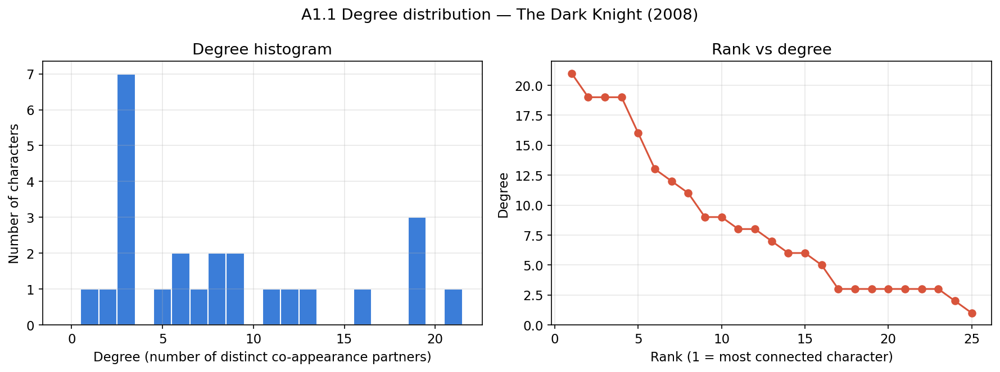
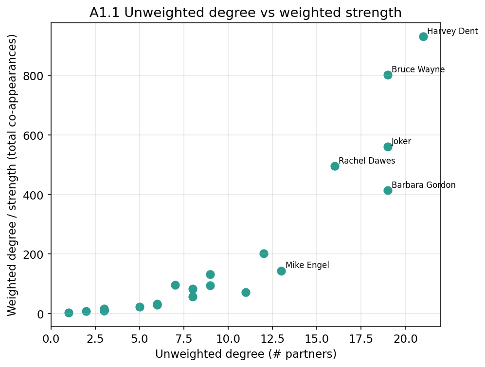
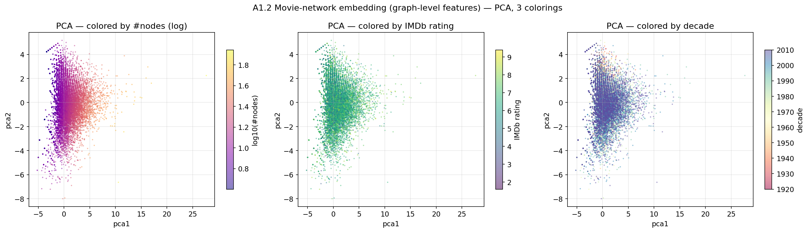
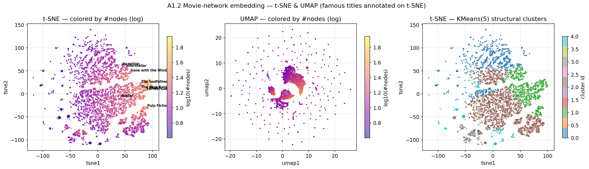
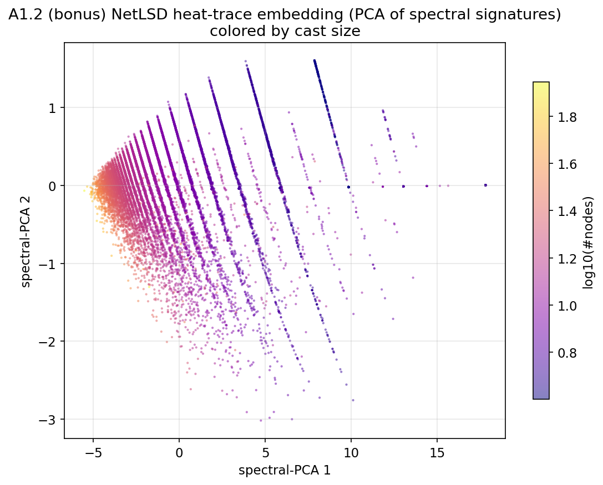
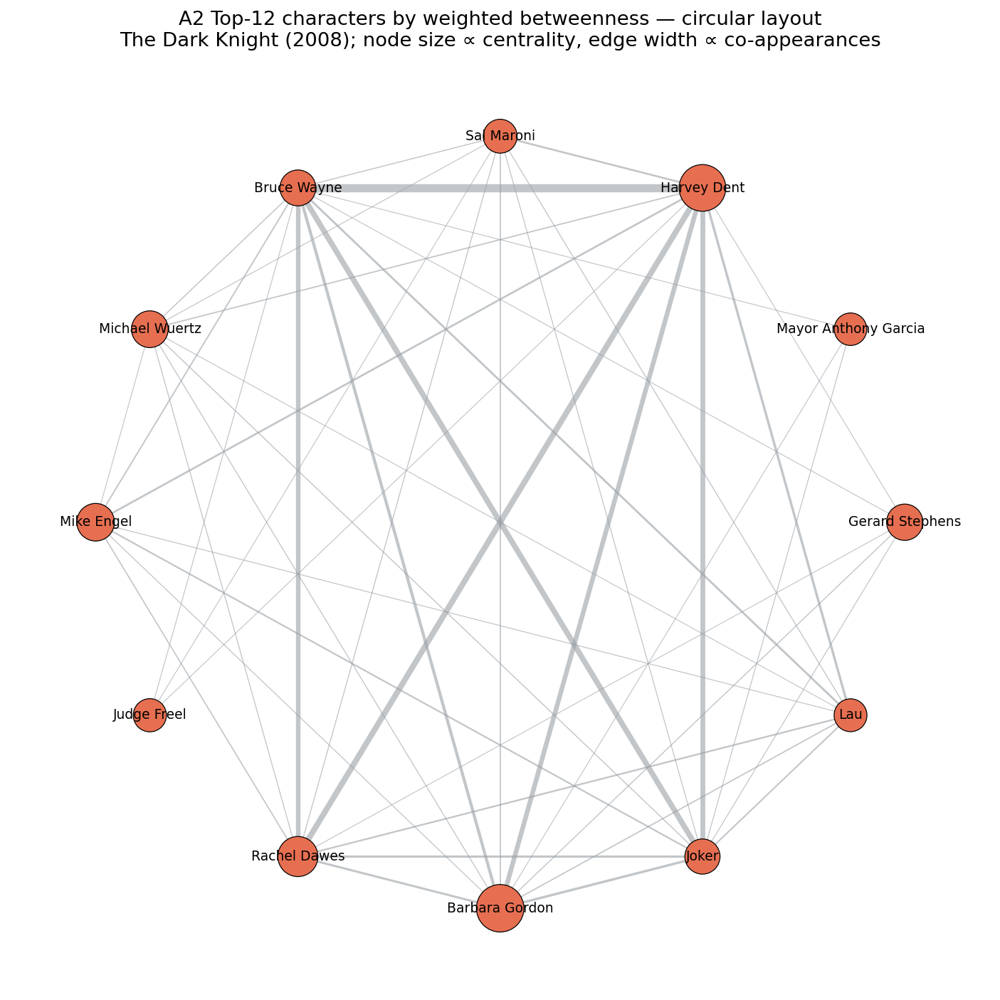
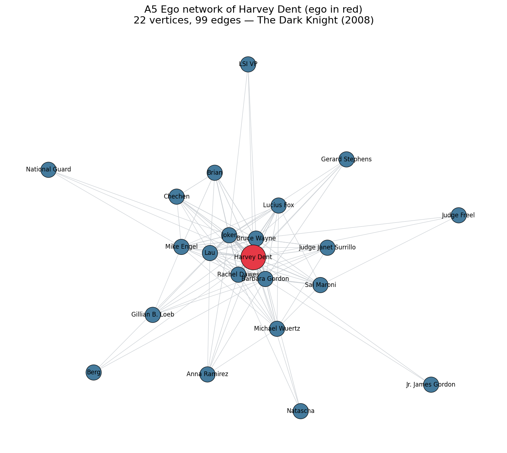

# Part A (core) — Movie / Social Network Analysis

This file is the written report for the **core** Part A tasks: **A1.1** (degree
distribution), **A1.2** (graph embeddings of many movie networks), **A2** (top-12
character subgraph), **A3** (PageRank / triangles / shortest paths), and **A5**
(ego network function). The runnable, fully-executed code with embedded outputs
lives in the companion notebook `notebooks/partA_core.ipynb`.

I have written this report the way I like explanations: long but plain. Every
technical term is defined in everyday language the first time it appears, and I
build each idea up from the underlying intuition rather than just stating a
conclusion.

---

## What a "movie network" is (shared background for every task)

A **network** (also called a **graph**) is just a collection of dots, called
**vertices** or **nodes**, joined by lines, called **edges**. In this dataset
each node is a *character* in a movie, and an edge between two characters means
they *appeared on screen together* at least once. Each edge also carries a number
called its **weight**, which is simply *how many times* the two characters
co-appeared. So a thick, heavy edge means "these two share a lot of scenes", and
a thin one means "they crossed paths only briefly".

The graphs are **undirected** (a co-appearance has no direction — if A appears
with B then B appears with A) and **weighted** (edges carry the co-appearance
count). For the single-network tasks I use the selected movie **The Dark Knight
(2008)**, whose network has **25 characters** and **106 edges**. For A1.2 I use
**all ~15,538** movie networks at once.

**Data source (Kaggle):** `michaelfire/movie-dynamics-over-15000-movie-social-networks`
— <https://www.kaggle.com/datasets/michaelfire/movie-dynamics-over-15000-movie-social-networks>

**Libraries used:** `networkx` (graph algorithms), `numpy` / `pandas` (numbers
and tables), `scikit-learn` (StandardScaler, PCA, t-SNE, KMeans,
NearestNeighbors), `umap-learn` (UMAP projection), `scipy`/`numpy.linalg`
(Laplacian eigenvalues for the NetLSD signature), and `matplotlib` + `seaborn`
(plots). All plotting uses the headless **Agg** backend because the cluster has
no screen.

---

## A1.1 — Degree distribution

### Results summary

The **degree** of a vertex is how many edges touch it — in plain words, how many
*different* characters this character ever shared a scene with. Because the edges
are weighted, there are two flavours:

- **Unweighted degree** = number of *distinct* co-appearance partners.
- **Weighted degree**, called **strength** = the *sum* of the weights of a
  character's edges, i.e. their total amount of screen-sharing.

The most connected characters in The Dark Knight are:

| Rank | Character | Degree | Strength |
|------|-----------|-------:|---------:|
| 1 | Harvey Dent / Two-Face | 21 | 931 |
| 2 | Bruce Wayne / Batman | 19 | 802 |
| 3 | Joker | 19 | 561 |
| 4 | Barbara Gordon | 19 | 414 |
| 5 | Rachel Dawes | 16 | 496 |

The average degree is about **8.5** and the maximum is **21** (out of a possible
24). The degree distribution is **right-skewed**: most characters have a small to
medium degree, and only a handful sit far out on the right.

### What the shape tells us

The histogram and the rank-vs-degree curve both describe the same thing: a small
core of central characters that almost everyone interacts with, surrounded by
many minor characters who touch the story only briefly. This is the classic
**hub-and-spoke** look of a story with clear protagonists and antagonists.

A misconception worth heading off: it is tempting to call this a **power-law** or
**scale-free** network (one where the chance of a vertex of degree *k* falls off
like *k* to a negative power, producing a few giant hubs). With only 25 vertices
we cannot claim that honestly — a power law is a statement about the long tail of
a distribution over many orders of magnitude, and 25 points give us no tail to
speak of. So the honest description is "hub-and-spoke / right-skewed, consistent
with a few central characters", not "power law".

The degree-vs-strength comparison adds nuance. The two measures mostly agree, but
not perfectly: the Joker ties for second in *partners* (degree 19) yet his
*total* screen-sharing (strength 561) is well below Batman's (802). In story
terms, the Joker meets almost as many characters as Batman but spends fewer total
scenes with them — fitting a chaotic agent who touches many lives briefly.

### How I solved this task

I computed each vertex's degree with NetworkX's `G.degree()` and its strength
with `G.degree(weight="weight")`, put both in a sorted pandas table, and drew a
histogram, a rank-vs-degree plot, and a degree-vs-strength scatter. I chose plain
degree/strength because degree is the most basic and interpretable centrality and
the task asks specifically for the degree distribution. The main result is a
clear hub-and-spoke structure with Harvey Dent, Batman, Joker and Gordon as the
hubs, on a graph too small to claim a power law.

---

## A1.2 — Graph embeddings of all movie networks

### Results summary

To compare all ~15,538 movies, each whole network has to become a single
**point** in space so that structurally similar movies land near each other.
Turning a whole graph into a fixed list of numbers (a **vector**) is called a
**graph embedding**. I used the **graph-level feature vector** approach: for each
movie I measured 13 structural properties and stacked them into a vector. The
features are number of nodes, number of edges, **density** (edges present ÷ edges
possible), **average clustering coefficient** (do a character's partners tend to
also be partners of each other?), **transitivity** (the global triangle-closing
rate), the degree mean / standard deviation / maximum, **degree assortativity**
(do hubs connect to hubs or to minor characters?), the number of **connected
components** (islands of the graph), the largest-component fraction, the
**average shortest path length** and the **(approximate) diameter** on the
largest island.

Extracting these features for the **entire** dataset took only about **45–50
seconds**, so I used *every* movie — no sampling was needed, and therefore no
sampling bias to justify. Degenerate graphs (fewer than 3 nodes, or no edges)
are wrapped in `try/except` and skipped; in practice **0** were skipped. The
table is saved to **`data/movies/graph_features.csv`**.

I standardized the features with **StandardScaler** (rescale each feature to mean
0, standard deviation 1, so a large-numbered feature like #edges does not drown
out a small one like density) and projected to 2D three ways:

- **PCA** (Principal Component Analysis) — finds the two directions of greatest
  variation and uses them as axes; linear, fast, deterministic. Its two axes
  explain about **68%** of all variation.
- **t-SNE** — a non-linear method that keeps near-neighbours near; great for
  revealing clusters (took ~107 s on 15.5k points).
- **UMAP** — similar to t-SNE but faster and keeps a little more global layout
  (~59 s).

### Clusters and similar movies

A **KMeans** clustering into 5 groups reveals intuitive structural "types": a
**large-ensemble** type (~22 characters, high maximum degree ~19), a
**tiny-but-fully-connected** type (~7 characters but density ~0.70 and clustering
~0.79), a mid-size moderately-clustered type, and a sparse small-cast type.

Colouring the points by **cast size** produces a smooth gradient across the
whole map — the single biggest thing the embedding captures is *how large the
cast is*. Colouring by **IMDb rating** shows essentially no pattern, and by
**decade** only a mild drift. The useful finding: network shape is mostly about
cast size and connectivity, **not** about how good or how old a movie is.

A nearest-neighbour search finds the movies whose feature vectors sit closest to
The Dark Knight's. They share its fingerprint — a fairly large cast (~21–23
maximum degree), high average clustering (~0.75–0.82), similar density — i.e. a
big group whose core characters are all tightly interwoven. The titles that
surface (for example *Allegiant*, *Now You See Me*, *Soul Surfer*, *It's
Complicated*) have nothing to do with Batman in *content*; they are similar
purely in **network shape**. That is exactly the point of a structural embedding.

### Second method (bonus): NetLSD heat-trace

As a second, label-independent embedding I computed a **NetLSD-style heat-trace
signature**. Every graph has special numbers called the **eigenvalues** of its
normalized Laplacian (a matrix encoding who connects to whom); they act like the
graph's natural "frequencies". The heat trace *h(t) = Σ exp(−t·λ)* imagines
dropping heat on the graph and measuring how much remains after time *t*;
sampling *h(t)* at several times gives a fixed-length fingerprint of the whole
graph that does not depend on how nodes were labelled.

The two methods agree: both lay movies out mainly along a "small/simple ↔
large/complex" gradient, which is why cast size lights up in both. The feature
vector is easier to interpret (named axes like density and clustering); NetLSD is
label-independent and captures subtler multi-scale shape. Their agreement is
reassuring — the structure is real, not an artefact of one method.

### What it captures and misses

- **Captures:** size, density, cliquey-ness, the spread of the degree
  distribution, fragmentation, and social closeness — the *shape* of the network.
- **Misses:** *who* the characters are, the plot, genre, dialogue, the order of
  scenes (temporal info is ignored here), and edge weights beyond a few summary
  statistics. Two films with identical shape but opposite stories land together.

### How I solved this task

I represented each movie network as a 13-number graph-level feature vector,
chosen over Graph2Vec/WL kernels because every dimension is human-interpretable,
it needs no training, and it ran over the whole dataset in under a minute (so no
sampling). I saved the table, standardized it, and projected to 2D with PCA,
t-SNE and UMAP, added KMeans(5) clustering and a nearest-neighbour search to name
concrete similar movies, and a NetLSD heat-trace as a second method. Main result:
movie networks organise chiefly by cast size and connectivity (not rating or
era), fall into a few clear structural types, and The Dark Knight's closest
structural cousins are other large, tightly-clustered ensemble films.

---

## A2 — Top-12 character subgraph (circular layout)

### Results summary

A **centrality** is a number scoring "how important is this vertex?". I chose
**betweenness centrality**, which measures how often a vertex lies on the
**shortest paths** between other vertices — a *bridge / broker* score: if many of
the shortest routes between characters must pass through you, you connect
otherwise-separate parts of the cast. I used the **weighted** version (treating a
heavier edge as a stronger, hence shorter, tie). I chose betweenness because A1.1
already covered raw popularity via degree/strength, so betweenness adds *new*
information — it surfaces the narrative bridges that hold the cast together.

The top-12 by weighted betweenness are (ordered): Barbara Gordon, Harvey Dent,
Rachel Dawes, Mike Engel, Michael Wuertz, Gerard Stephens, Bruce Wayne, Joker,
Sal Maroni, Judge Freel, Lau, Mayor Anthony Garcia. I built the **induced
subgraph** on these 12 (the 12 nodes plus every edge among them) and drew it with
a **circular layout** (`nx.circular_layout`), node size proportional to
centrality and edge width proportional to co-appearance weight.

### What the picture shows

The circular layout ignores position on purpose so the eye focuses on node size
(centrality) and edge thickness (co-appearances). The biggest nodes are the
story's load-bearing leads, and the thickest edges are the relationships the film
spends the most time on (the Batman–Dent–Rachel triangle that drives the plot).
The picture is a map of the movie's **core cast**: a tight, densely interlinked
inner circle, with a few smaller bridge characters (reporters, mobsters,
officials) attached. The Dark Knight is held together by a small set of mutually
connected leads rather than one lone protagonist.

### How I solved this task

I computed weighted betweenness with NetworkX, kept the top 12, built the induced
subgraph with `G.subgraph(...)`, and drew it with `nx.circular_layout`, encoding
centrality as node size and weight as edge width. I chose betweenness for its
bridge/broker meaning, which complements A1.1's popularity view. The result is a
clear portrait of the interconnected core cast.

---

## A3 — PageRank, triangles, and shortest paths per vertex

### Results summary

For **every** character I computed three numbers, each a different notion of
importance:

- **PageRank** — the random-surfer importance score (the algorithm Google was
  built on). It is *recursive*: you matter if *important* characters share scenes
  with you, not merely if many do. I use the weighted version.
- **Number of triangles** — how many *triangles* (three mutually co-appearing
  characters) a vertex sits in; high means embedded in a cohesive clique.
- **Average shortest path length** — the average number of hops to every other
  *reachable* character; small means close to everyone, large means peripheral.

**Disconnection handling:** I average each character's distance only over the
characters it can actually reach (and also report how many that is), so a split
graph would never produce an infinite average. For The Dark Knight this does not
bite — the graph is a **single connected component**, so every character reaches
all 24 others — but the code is written to behave correctly regardless, and the
connectivity check is printed.

Top characters by PageRank: **Harvey Dent (~0.19)**, Batman (~0.16), Joker
(~0.12), Rachel Dawes (~0.10), Barbara Gordon (~0.10). The smallest average
shortest path belongs to Harvey Dent (~1.13) and Batman (~1.21) — they reach
essentially everyone in about one hop; the largest belongs to fringe characters
(e.g. "Brian" at ~1.75).

### The most interesting vertices

The three measures agree on *who* the core is but differ on *why* each matters:
PageRank = "important company", triangles = "embedded in a clique", short paths =
"close to everyone". Harvey Dent tops all three, matching his role as the pivotal
figure whose fate everything turns on. The Joker is the instructive exception —
high PageRank and many partners, yet not the very closest on average, fitting a
character who injects himself into the main story while remaining an outsider.

### How I solved this task

I computed weighted **PageRank** (`nx.pagerank`), per-vertex **triangle** counts
(`nx.triangles`), and per-vertex **average shortest path length** (all-pairs
shortest paths, averaged over reachable nodes only), and presented them in one
pandas DataFrame, one row per character. I chose these three because together
they triangulate importance from three angles. Main result: a small,
mutually-reinforcing core (Dent, Batman, Joker, Rachel, Gordon) scores high on
all three.

---

## A5 — Ego network function

### Results summary

An **ego network** of a chosen vertex (the "ego") is the ego plus all its
neighbours, together with the edges among that set — the character's immediate
social world. The task asks for the ego plus **incoming** and **outgoing**
neighbours. That wording is for **directed** graphs, where an edge is an arrow:
an *outgoing neighbour* (successor) is someone the ego points to, an *incoming
neighbour* (predecessor) is someone who points to the ego.

Our movie graph is **undirected**, so incoming and outgoing neighbours are the
**same set** (both equal "all neighbours"), and their union is just "all
neighbours". My function handles both cases: for a directed graph it unions
predecessors and successors; for an undirected graph it uses `G.neighbors`. I
demonstrated the directed branch on a tiny directed toy graph
(`A→B, A→D, C→A, E→F`), confirming that `ego_subgraph(A)` correctly returns
`{A, B, C, D}` and excludes the unrelated `E, F`, and I re-ran the function on a
directed view of the movie (`G.to_directed()`) to confirm the node sets match.

I chose the **highest-degree character, Harvey Dent / Two-Face**, as the ego. His
ego network has **22 vertices** and **99 edges**.

### What the ego network reveals

Two things stand out. First, Dent's ego network contains **22 of the movie's 25
characters** — zooming in on just Dent and his direct scene-partners recovers
almost the entire cast, so Dent is a near-universal hub. Second, those neighbours
are heavily linked to *each other* (99 edges among 22 nodes), not arranged as a
simple star. Dent therefore sits *inside* the tightly-woven main cast, at the
centre of the movie's social fabric — consistent with his top scores on degree,
PageRank, triangles and closeness in the earlier tasks, and with his narrative
role as the pivotal figure whose downfall ripples through the whole story.

### How I solved this task

I wrote `ego_subgraph(G, v)` returning the subgraph induced by `v` plus all its
neighbours, explicitly handling the directed case (union of predecessors and
successors) and the undirected case (all neighbours), and explained why they
coincide for our undirected graph. I demonstrated the directed branch on a toy
graph and a directed view of the movie, chose the highest-degree character as the
ego, drew the ego network with the ego highlighted, and printed the vertex and
edge counts. Main result: Dent's one-hop neighbourhood spans almost the whole
movie and is densely interconnected, marking him as the central, deeply-embedded
hub of The Dark Knight.

---

## Limitations & assumptions

- **Tiny single network.** The Dark Knight graph has only 25 nodes, so I describe
  the degree distribution shape qualitatively rather than fitting a heavy-tailed
  (power-law) model.
- **Co-appearance ≠ relationship.** Edges record that characters appeared
  together, a proxy for interaction, not a guarantee of a meaningful on-screen
  relationship.
- **Structural-only embedding (A1.2).** The feature/NetLSD embeddings capture
  graph *shape* but ignore character identities, dialogue, plot, genre and the
  temporal order of scenes; nearby movies are structurally — not thematically —
  similar.
- **Approximations for scale.** Diameter uses NetworkX's fast approximation, and
  path metrics are skipped on any component larger than 2000 nodes (then
  median-imputed) so the full-dataset run stays fast; almost all movies are far
  below the cap.
- **Reproducibility.** Random seeds are fixed at 42, but t-SNE/UMAP/KMeans can
  shift slightly across library versions; the qualitative picture is stable.

---

## Files produced by this part

- Notebook: `notebooks/partA_core.ipynb` (fully executed, outputs embedded).
- Feature table: `data/movies/graph_features.csv` (one row per movie, 13
  structural features plus metadata).
- Figures (in `figures/`, all prefixed `partA_`): `partA_degree_dist.png`,
  `partA_degree_vs_strength.png`, `partA_embed_pca.png`,
  `partA_embed_tsne_umap.png`, `partA_embed_netlsd.png`,
  `partA_top12_subgraph.png`, `partA_ego_network.png`.
