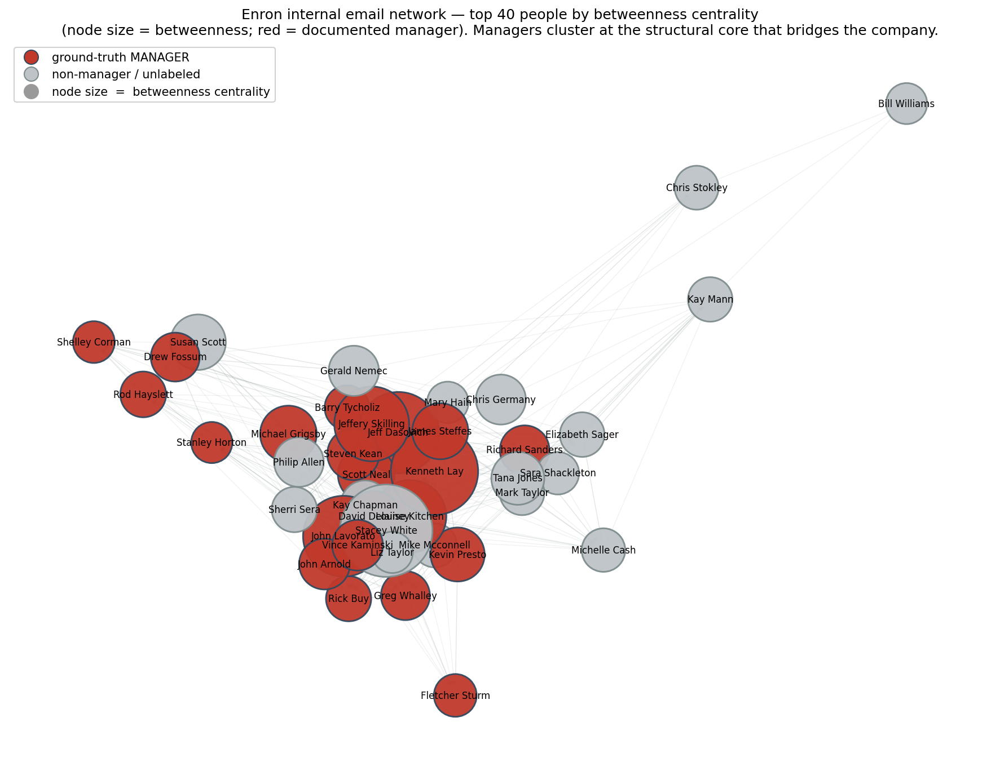
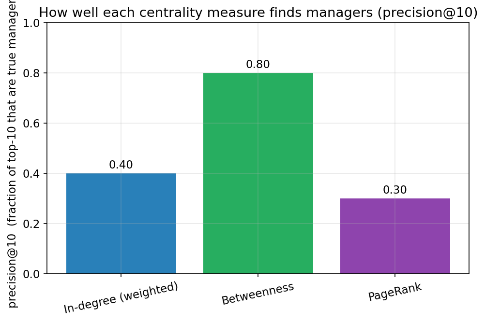

# Part C — Enron Manager Detection with Centrality and a Local LLM (35 pts)

**Notebook:** `notebooks/partC_enron_llm.ipynb` (executed end-to-end with no errors).
**Local LLM:** `qwen2.5:14b` served by Ollama on the faculty GPU cluster — no email text
ever left the cluster. **Random seed:** 42. **Libraries:** `networkx`, `pandas`, `numpy`,
`matplotlib`, Python's built-in `tarfile` + `email`, and the project's `na_utils` helper.

This part builds a directed email network from the real Enron emails, then tries to find
the company's managers three different ways — by network **centrality**, by a **local
LLM** reading people's writing, and against a documented **ground-truth** list of job
titles — and compares the three.

A note on how this report is written: it explains each idea in plain English and defines
every technical term the first time it appears, so it can be read by someone new to network
analysis. Each task ends with a short *"How I solved this task"* box.

---

## C1.1 — The network, the labels, and all preprocessing (5 pts)

### What the Enron corpus is

Enron was a large US energy-trading company that collapsed in a 2001 accounting-fraud
scandal. During the investigation the regulator released about half a million of the
company's internal emails. That public collection is the **CMU Enron email corpus**, and
it is the standard dataset for "who are the managers?" experiments because it is one of the
very few large, real, *named* corporate email sets in existence.

We used the tarball `data/enron/enron_mail_20150507.tar.gz`. We **verified the download
was complete and valid before parsing**: its size matched the server's `Content-Length`
exactly (443,254,787 bytes ≈ 423 MiB), a full gzip integrity test passed, and it lists
**520,901** files without error. It unpacks to `maildir/<person>/<folder>/<number>.`, one
email per file, for **150 mailbox owners** (the employees whose mailboxes were seized).

There is also an anonymized version on SNAP (`data/enron/email-Enron.txt`) that uses
integer IDs and has *no names and no text*. We mention it for completeness but do **not**
use it, because Part C needs names and content.

### What the nodes and edges represent

We build a **directed graph** (a network of dots connected by arrows). The dots are
**nodes**, the arrows are **edges**, and "directed" means each edge has a direction, like a
one-way street.

- A **node** = one internal email address, e.g. `kenneth.lay@enron.com`.
- An **edge** `A → B` = "person A sent at least one email to person B".
- The edge **weight** = *how many* emails A sent to B (like the thickness of the arrow).

Tiny example: Alice sends Bob 5 emails and Bob sends Alice 2 → two edges, `Alice→Bob`
(weight 5) and `Bob→Alice` (weight 2). They point opposite ways because who emails whom is
not symmetric.

**Resulting network:** **8,720 nodes** and **27,209 directed edges**, carrying **225,154**
messages in total.

### The managerial labels (ground truth) and their source

To *score* a manager detector we need a trusted answer key. We use a widely re-used
annotation that maps Enron email addresses to **job titles**, originating from the **ISI /
Diesner–Carley** Enron studies. We obtained a clean, email-keyed copy from the public
GitHub repo `burgersmoke/enron-formality`
(`enron_employee_positions/reranked_employee_email_positions.csv`), saved here as
`data/enron/enron_email_positions.csv`. Each row is `Name, email, title, level`. (This is a
documented public list, so we did **not** need the fallback hand-curated list the
assignment offered.)

A "label" is a yes/no tag: **1 = manager**, **0 = not a manager**. We turn each documented
title into that tag with this fixed rule:

| Tag | Titles mapped to it |
|-----|---------------------|
| **MANAGER (1)** | CEO, COO, CFO, President, Chairman, Vice President, Managing Director, Director, Director of Trading, Manager |
| **NON-MANAGER (0)** | Employee, Trader, Analyst, Specialist, Associate, Assistant, In House Lawyer, Attorney, Cnsl |
| **Unlabeled (skipped)** | title = `N/A` (the source did not know the title) |

This yields **116 managers** and **53 non-managers** among labeled people (29 are `N/A`).
Of the labeled addresses, **177** appear as nodes in our graph.

### Preprocessing — exactly what we did and why

1. **Only "sent" folders parsed.** Each mailbox has `sent`, `sent_items`, `_sent_mail`,
   `_sent`. These hold mail the owner *wrote*, so the `From:` line is trustworthy. We
   parsed **126,591** sent messages this way (the standard approach for reliable
   authorship).
2. **Streamed, not extracted.** Unpacking 520k tiny files onto a shared network disk is
   very slow, so we opened the `.tar.gz` and read each email's bytes *in memory* with
   `tarfile`, parsing headers/body with the `email` library.
3. **Lenient parser.** The strict email parser crashes on the corpus's many malformed
   address headers, so we used the legacy parser (`policy.compat32`) and extracted
   addresses with a regular expression.
4. **Internal-only filter.** We keep an edge only when *both* sender and recipient are
   `@enron.com`, focusing on the internal org and dropping outside contacts.
5. **Recipients = To + Cc, de-duplicated**, one edge per distinct internal recipient,
   weight += 1.
6. **Folder → email mapping.** We did not have to guess emails from folder names like
   `lay-k`; the `From:` header inside each sent email already gives the real address.
7. **Body cleaning for the LLM.** We strip quoted replies / forwarded chains (text after
   "-----Original Message-----", "Forwarded by …", quoted `>` lines, BlackBerry
   signatures) and cap length, so the LLM mostly sees what the author actually wrote.

Parse statistics (written to `data/enron/parse_stats.json`): 126,591 sent messages parsed;
94,326 produced internal edges; 27,209 distinct directed edges; 260 distinct internal
senders; 11,328 cleaned email records kept for the LLM step.

> **How I solved this task (C1.1).** I built a directed, weighted internal email network
> from the real CMU Enron corpus by streaming the tarball in memory and parsing only the
> "sent" folders for reliable authorship; nodes are `@enron.com` addresses, edges are
> "A emailed B", weights count the messages, and I kept only internal-to-internal mail. I
> used `tarfile` + `email` (lenient parser + regex addresses) and NetworkX. Streaming
> avoids unpacking half a million files; the sent-folder and internal-only choices keep
> authorship trustworthy and the graph focused. The result is a clean ~8.7k-node /
> ~27k-edge network plus a documented title-based answer key (116 managers, 53
> non-managers) to test detectors against.

---

## C1.2 — Three centrality algorithms + precision@10 (5 pts)

### What "centrality" means

**Centrality** is a family of formulas that score every node by how important/central it
is in the network. There is no single notion of "important", so different measures capture
different flavours. The hunch behind using them for manager detection: managers probably
sit at busy, central spots in the email network. We test that with three *contrasting*
measures:

- **In-degree centrality (weighted)** = how many emails a node *received* (summed with
  weights). Analogy: the size of your inbox. (Pure local popularity.)
- **Betweenness centrality** = of all the shortest paths (fewest hops) between every pair
  of people, what fraction pass through node X? A high score means X is a **bridge**
  connecting groups that otherwise wouldn't talk directly. (Global bridging.)
- **PageRank** = imagine a "random surfer" hopping along arrows; PageRank is the long-run
  share of time spent at each node, where *you are important if important people point to
  you*. (Recursive prestige.)

We picked these three because they lean on genuinely different structure (local count vs.
path-bridging vs. recursive prestige), so the comparison is informative.

### What precision@10 means

For each measure we take its **top 10** nodes and ask: how many are real managers per our
answer key? That count ÷ 10 is **precision@10**. "Precision" = "of the things you flagged,
what fraction were correct"; "@10" fixes the list length at 10. Example: 8 of 10 correct →
0.80.

**Unlabeled top-10 nodes:** some top-10 nodes have no label (title `N/A`, or shared
mailboxes). We keep the denominator fixed at **10** (so an unlabeled slot cannot inflate
the score), and also report how many of the 10 were actually labeled. This is the strict,
conservative convention.

### Results — top-10 per measure

**Betweenness — precision@10 = 0.80** (8 confirmed managers; 8/10 labeled):

| rank | name | title | manager? |
|---|---|---|---|
| 1 | Stacey White / `sally.beck` | N/A | unlabeled |
| 2 | Kenneth Lay | CEO | MANAGER |
| 3 | Jeff Dasovich | Managing Director | MANAGER |
| 4 | John Lavorato | CEO | MANAGER |
| 5 | Jeffery Skilling | CEO | MANAGER |
| 6 | Louise Kitchen | President | MANAGER |
| 7 | Scott Neal | Vice President | MANAGER |
| 8 | Michael Grigsby | Manager | MANAGER |
| 9 | James Steffes | Vice President | MANAGER |
| 10 | Susan Scott | (unlabeled) | — |

**In-degree (weighted) — precision@10 = 0.40** (4 confirmed managers; 5/10 labeled):

| rank | name | title | manager? |
|---|---|---|---|
| 1 | Richard Shapiro | Vice President | MANAGER |
| 2 | Shirley Crenshaw | (unlabeled) | — |
| 3 | James Steffes | Vice President | MANAGER |
| 4 | Susan Mara | (unlabeled) | — |
| 5 | John Lavorato | CEO | MANAGER |
| 6 | Paul Kaufman | (unlabeled) | — |
| 7 | Suzanne Adams | (unlabeled) | — |
| 8 | Mark Taylor | Employee | non-mgr |
| 9 | Timothy Belden | Managing Director | MANAGER |
| 10 | Jeffrey Hodge | (unlabeled) | — |

**PageRank — precision@10 = 0.30** (3 confirmed managers; 3/10 labeled):

| rank | name | title | manager? |
|---|---|---|---|
| 1 | Jae Black | (unlabeled) | — |
| 2 | Blair Lichtenwalter | (unlabeled) | — |
| 3 | Fletcher Sturm | Vice President | MANAGER |
| 4 | John Lavorato | CEO | MANAGER |
| 5 | Casey Evans | (unlabeled) | — |
| 6 | John Postlethwaite | (unlabeled) | — |
| 7 | Ina Rangel | (unlabeled) | — |
| 8 | Michael Grigsby | Manager | MANAGER |
| 9 | Parking Transportation | (unlabeled) | — |
| 10 | Debra Perlingiere | (unlabeled) | — |

### Precision@10 comparison

| centrality measure | precision@10 |
|---|---|
| **Betweenness** | **0.80** |
| In-degree (weighted) | 0.40 |
| PageRank | 0.30 |

See `figures/partC_precision_at_10.png`.

### Comparing the three algorithms

- **Betweenness wins by a wide margin.** Its top-10 is a who's-who of real senior people
  (Lay, Skilling, Lavorato, Kitchen, Beck, Dasovich…). This fits intuition: real managers
  act as **bridges** between teams, so shortest paths funnel through them.
- **In-degree** is moderate. It surfaces real VPs but also promotes **assistants /
  schedulers** who receive huge mail volumes without managing anyone — pure inbox size
  confuses "busy" with "senior".
- **PageRank** does worst. Following *who emails whom* rewards people pointed at by other
  well-connected people, which here often means non-manager **hubs** (shared mailboxes,
  schedulers, very active traders). Prestige-by-association is a noisy proxy for org rank
  in email data.

> **How I solved this task (C1.2).** I scored every node with three contrasting centrality
> measures (NetworkX `in_degree(weight=…)`, `betweenness_centrality`, `pagerank`), took
> each top 10, and computed precision@10 against the title labels (denominator fixed at 10;
> unlabeled slots cannot inflate the score). I chose these three because they capture local
> popularity, global bridging, and recursive prestige. Betweenness is clearly the best
> structural detector here (0.80), because managers tend to be the bridges holding separate
> teams together; raw inbox size and PageRank get fooled by high-traffic non-managers.

---

## C1.3 — Local-LLM manager classification from email content (10 pts)

We switch from *structure* (who emails whom) to *content* (what people write). We give a
**local LLM** a small sample of each candidate's own emails and ask it to judge, purely
from the writing, whether the person sounds like a manager.

**Model and privacy.** An LLM (Large Language Model) reads a prompt and writes a response.
We used **`qwen2.5:14b`** ("14b" ≈ 14 billion parameters, a capable mid-sized open model)
served by **Ollama on the faculty GPU cluster**, called via `na.ollama_generate(...)`. This
keeps all email text **on the cluster** — the assignment forbids sending this private mail
to any outside service.

**Candidate selection.** We analyze the **union of the three centrality top-10 lists,
restricted to people who are both real senders and in the labeled answer key** (the
structure's "likely managers"), plus **three deliberately-planted non-managers** (a trader,
an employee, a staff lawyer) so the LLM has a fair chance to say "no". That gives **14
candidates** (10 true managers + 4 true non-managers).

**Email-selection rule.** For each candidate we feed **up to 6 of their own sent emails,
chosen as the longest** (after cleaning). Long emails carry the most role signal
(directives, planning, decisions); one-line replies say nothing. We also do **alias
pooling**: the same person appears under several addresses (e.g. `james.steffes@` vs
`d..steffes@`); without pooling, the exact candidate address sometimes has *zero* sent
emails (the mail lives under an alias), so we pool messages across all addresses mapping to
the same person name. Each email is cleaned and capped at ~900 characters.

**Output and caching.** We request strict JSON
`{"is_manager": true/false, "confidence": 0..1, "reason": "..."}` at **temperature 0.1**
(near-deterministic) and parse it robustly. **Every answer is cached to
`data/enron/llm_cache.json`**, so re-running the notebook does no further LLM calls.

### The exact prompt

```
You are analyzing workplace emails WRITTEN BY one employee at the energy company Enron.
Decide whether this person appears to be a MANAGER (someone who leads or directs other
people, sets strategy, approves decisions, or holds an executive / director /
vice-president title) versus a NON-MANAGER (an individual contributor such as a trader,
analyst, specialist, or staff lawyer).

EMAILS WRITTEN BY THE EMPLOYEE (<address>):
--- EMAIL 1 ---
Subject: <subject>
To: <up to 5 recipients>
Body:
<cleaned body, capped at ~900 chars>
... (up to 6 emails) ...

Base your judgement ONLY on the emails above. Respond with ONLY a JSON object, no other
text, in exactly this form:
{"is_manager": true or false, "confidence": a number between 0 and 1, "reason": "one short sentence"}
```

### Results — 6 emails analyzed per user

| name | LLM says | conf | true title | true label | LLM's one-line reason |
|---|---|---|---|---|---|
| Richard Shapiro | non-mgr | 0.85 | Vice President | MANAGER | detailed technical corrections, lacks strategic direction |
| John Lavorato | **manager** | 0.95 | CEO | MANAGER | leadership roles and strategic decision-making |
| Mark Taylor | non-mgr | 0.85 | Employee | non-mgr | technical discussions without managerial directives |
| Kenneth Lay | **manager** | 0.95 | CEO | MANAGER | sets company-wide policies, senior-level matters |
| Jeff Dasovich | **manager** | 0.95 | Managing Director | MANAGER | proposes actions and coordinates responses |
| Jeffery Skilling | **manager** | 0.95 | CEO | MANAGER | coordinates company-wide initiatives with high-level colleagues |
| Louise Kitchen | **manager** | 0.95 | President | MANAGER | strategic business decisions and governance |
| Scott Neal | non-mgr | 0.85 | Vice President | MANAGER | personal/social interactions rather than managerial duties |
| Michael Grigsby | non-mgr | 0.85 | Manager | MANAGER | focuses on technical details of trading |
| James Steffes | non-mgr | 0.85 | Vice President | MANAGER | (operational/regulatory detail, little directing) |
| Fletcher Sturm | **manager** | 0.95 | Vice President | MANAGER | (leadership/coordination signal) |
| Diana Scholtes | non-mgr | 0.85 | Trader | non-mgr | technical/operational, no leadership |
| Kam Keiser | **manager** | 0.95 | Employee | non-mgr | gives directives, manages a desk's schedule |
| Mary Hain | non-mgr | 0.85 | In House Lawyer | non-mgr | legal/technical, no managerial directives |

**Agreement with ground truth: 9 / 14 = 64%** (6 of 10 true managers correct; 3 of 4
true non-managers correct).

### Do I agree with the LLM?

- For the **C-suite** (Lay, Skilling, Lavorato, Kitchen, Dasovich) and **Sturm** the LLM
  says "manager" with high confidence, and **I agree** — their emails are full of strategy,
  approvals, coordinating large groups, and company-wide announcements.
- For the **planted non-managers** (Scholtes-trader, Mary Hain-lawyer, Mark Taylor) the LLM
  says "non-manager" and **I agree** — operational/technical detail with no directing of
  others.
- The **disagreements are informative, not random**. The LLM missed several VPs/Managers
  (Shapiro, Neal, Grigsby, Steffes) — but reading their sampled emails, they really *are*
  mostly operational ("detailed technical corrections", "social interactions", "technical
  details of trading"), so the LLM is judging the *writing* faithfully even where it
  conflicts with the *title*. And its one false positive, **Kam Keiser**, is a regular
  "Employee" whose emails read like a desk manager ("Everyone needs to be here by 8:00am",
  "promotions") — so the LLM's read of the text is defensible even though the title is
  junior. These are exactly the title-vs-behaviour gaps discussed in C1.6.

> **How I solved this task (C1.3).** For the structural top-10s plus three planted
> non-managers, I fed up to six of each person's longest cleaned sent emails (pooled across
> address aliases) to local `qwen2.5:14b` and asked for a strict JSON manager/non-manager
> verdict with a reason, at temperature 0.1, caching all answers. Content is independent
> evidence from structure; "longest emails" maximizes role signal; local-only keeps the
> mail private; caching makes the run fast and deterministic. The LLM matched the documented
> titles on 64% of labeled candidates and correctly rejected the planted non-managers,
> showing writing style is a usable but imperfect signal of managerial role.

---

## C1.4 — LLM role summaries with concrete evidence (5 pts)

For each of the **7 people the LLM flagged as managers**, we asked a *second* question:
"based only on these emails, what is this person's likely role?" — and we handed the model
**hard evidence we extracted from the data** so the summary is grounded: their top email
contacts (with message counts, from the graph), their recurring subject-line topics, and a
few email snippets. We also force an explicit **uncertainty note**. Selected cards:

**John Lavorato** — *documented title: CEO (of Enron Americas).*
> LLM role summary: "A high-level executive at Enron, possibly managing trading operations
> and overseeing critical business systems; frequently communicates with other senior
> executives about operational and strategic matters."
- Emails most often TO: David Delainey (105), David Oxley (81), Kimberly Hillis (75).
- Emails most often FROM: David Delainey (226), Louise Kitchen (119), John Arnold (101).
- Recurring topics: systems, information, participation, December, Ontario.
- Uncertainty: based only on the email sample; may not capture all aspects of the role.

**Kenneth Lay** — *documented title: Chairman / CEO.*
> LLM role summary: "Appears to be the Chairman of Enron or a high-ranking executive, given
> references to Jeff Skilling and his role overseeing programs like the Associate/Analyst
> Program."
- Emails most often FROM: Steven Kean (his chief of staff), Maureen Mcvicker (his
  assistant), David Delainey.
- Recurring topics: jeff, kenneth, executive, committee, requested.
- Uncertainty: based solely on email content; may miss aspects of the role.

**Jeff Dasovich** — *documented title: Managing Director (Government/Regulatory Affairs).*
> LLM role summary: "An energy-policy / regulatory-affairs specialist likely involved in
> California's power-market issues and legislative matters; frequently communicates with
> senior executives about FERC filings, press releases, and state-legislature documents."
- Emails most often TO: Susan Mara (981), Paul Kaufman (965), Richard Shapiro (936), James
  Steffes (879) — i.e. exactly Enron's regulatory-affairs team.
- Recurring topics: power, California, FERC.
- Uncertainty: inferred from a sample; the precise title is uncertain.

(The notebook prints full cards for all 7: Lavorato, Lay, Dasovich, Skilling, Kitchen,
Sturm, Keiser.)

> **How I solved this task (C1.4).** For every LLM-identified manager I extracted hard
> evidence from the data (top email contacts with counts via `in_edges`/`out_edges` by
> weight, and recurring subject words), fed that plus snippets to `qwen2.5:14b` (cached),
> and asked for a short grounded role summary plus an uncertainty note. Giving the model
> concrete, data-derived evidence keeps the summary anchored to reality and the uncertainty
> field keeps it honest. The result is a readable, evidence-backed role description per
> manager (e.g. Dasovich = regulatory affairs, contacting the regulatory team about FERC /
> California), with a clear caveat that it is inferred from a small email sample.

---

## C1.5 — Network visualization (5 pts)

A picture of all 8,720 nodes would be an unreadable hairball, so we visualize a
**meaningful subgraph**: the **top 40 people by betweenness centrality** (our best
detector) and the edges among them.

- **Node size** ∝ **betweenness centrality** (bigger = stronger bridge).
- **Colour** highlights likely managers: ground-truth managers are drawn red with a dark
  outline; everyone else is pale grey.
- **Spring (force-directed) layout**: edges act like springs pulling connected nodes
  together while all nodes repel, so tightly-communicating groups cluster and the picture
  untangles.



*Figure: top-40 by betweenness; node size = betweenness; red = documented manager. The red
manager nodes are large and sit in the dense bridging core — a visual confirmation that
betweenness centrality and managerial rank line up in this network.*



*Figure: precision@10 of the three centrality measures (Betweenness 0.80, In-degree 0.40,
PageRank 0.30).*

We also exported the subgraph (with name / betweenness / pagerank / is_manager / title
attributes) to `exports/partC_enron_top.gexf` for interactive exploration in Gephi or
Cytoscape.

> **How I solved this task (C1.5).** I drew the 40 most central people (by betweenness) as
> a force-directed graph with node size = betweenness and documented managers highlighted in
> red, plus a precision@10 bar chart, and exported the subgraph as GEXF. I used NetworkX
> `spring_layout` + matplotlib (headless Agg backend) and `write_gexf`. The full graph is an
> unreadable hairball, so a meaningful top-K subgraph with size-encoded centrality and
> colour-encoded labels communicates the key finding at a glance: the manager nodes are big
> and central.

---

## C1.6 — Discussion: centrality vs LLM vs ground truth (5 pts)

Side-by-side on the 14 candidates (full table in the notebook):

| name | in centrality top-10? | LLM | ground truth | title |
|---|---|---|---|---|
| Richard Shapiro | yes | non-mgr | MANAGER | Vice President |
| John Lavorato | yes | manager | MANAGER | CEO |
| Mark Taylor | yes | non-mgr | non-mgr | Employee |
| Kenneth Lay | yes | manager | MANAGER | CEO |
| Jeff Dasovich | yes | manager | MANAGER | Managing Director |
| Jeffery Skilling | yes | manager | MANAGER | CEO |
| Louise Kitchen | yes | manager | MANAGER | President |
| Scott Neal | yes | non-mgr | MANAGER | Vice President |
| Michael Grigsby | yes | non-mgr | MANAGER | Manager |
| James Steffes | yes | non-mgr | MANAGER | Vice President |
| Fletcher Sturm | yes | manager | MANAGER | Vice President |
| Diana Scholtes | no | non-mgr | non-mgr | Trader |
| Kam Keiser | no | manager | non-mgr | Employee |
| Mary Hain | no | non-mgr | non-mgr | In House Lawyer |

**Which method worked best?**

- For **ranking** people by likely seniority, **betweenness centrality** was the best
  purely structural method (precision@10 = 0.80, most credible top-10).
- For a **yes/no read on an individual**, the **local LLM** is the most useful: it
  correctly rejected the planted non-managers (something raw centrality cannot do, because a
  non-manager can still be a high-traffic hub) and nailed the C-suite. It agreed with the
  documented titles on 64% of labeled candidates.
- The **ground-truth titles** are the referee we score against, but they too are imperfect
  (29 people are `N/A`, and a *title* is not a perfect proxy for *managing people*).

**Where the methods disagreed, and why.**

- *Centrality false positives:* assistants/schedulers (huge inbox) and shared mailboxes
  (e.g. `parking.transportation@`) rank high on in-degree / PageRank without being
  managers — the structure says "busy", not "boss".
- *LLM vs title mismatches:* the most interesting cases. Several VPs/Managers (Shapiro,
  Neal, Grigsby, Steffes) *write* like operational contributors in their sampled emails, so
  the LLM calls them non-managers — judging the writing faithfully even against the title.
  Conversely, Kam Keiser ("Employee") *writes* like a desk manager ("Everyone in by
  8:00am", "promotions"), so the LLM calls him a manager. These show that **title and
  day-to-day managing are related but not identical**, and that a small email sample can
  point either way.
- *Address aliasing:* the same person appears under several addresses (e.g.
  `james.steffes@` vs `d..steffes@`, `richard.shapiro@` vs `shapiro@`). This splits a
  person's mail across nodes, can hurt their centrality, and — before we added alias pooling
  — left some candidates with no emails to analyze.

**Likely reasons for mistakes.** Small samples (only ~6 emails; if atypical, the verdict
wobbles); sent-folder bias (people who rarely sent mail are under-represented); label noise
(the title list has `N/A`s and judgement calls); imperfect regex cleaning that can leave
some quoted text in.

**Limitations of using email content + a local LLM for role detection.**

1. **Title ≠ management behaviour.** Email reflects behaviour, labels reflect titles, so
   perfect agreement is not even the right goal.
2. **Small, possibly skewed samples.** Six emails is a thin slice; the selection rule
   (longest) shapes the answer.
3. **The model can be confidently wrong.** LLMs produce fluent text even when guessing; the
   reported `confidence` is self-assessed, not a calibrated probability.
4. **Cleaning is imperfect.** Regex stripping of replies/signatures sometimes removes real
   content or leaves boilerplate.
5. **Privacy / ethics.** These are real people's private messages (kept on the local
   cluster); conclusions about individuals are illustrative, not authoritative.
6. **Generalization.** The pipeline is tuned to Enron's folder layout and 2000–2001 era.

> **How I solved this task (C1.6).** I placed the three opinions (centrality membership,
> LLM verdict, ground-truth title) side by side for every candidate and analyzed the
> agreements and disagreements with a comparison table plus reasoning about failure modes.
> Triangulating three independent signals is how you judge a detector's real strengths and
> blind spots. The conclusion: betweenness is the best *structural* ranker, the local LLM is
> the best *individual yes/no* judge, and titles are a useful but imperfect referee — and the
> disagreements themselves are informative, exposing assistants-as-hubs, the
> title-vs-behaviour gap, and address aliasing.

---

## Assumptions, sampling choices, and reproducibility

- **Sampling:** only "sent" folders parsed; internal-to-internal edges only; for the LLM,
  up to 6 longest cleaned emails per candidate (pooled across aliases); 14 candidates
  total. All choices are documented above with rationale.
- **Determinism:** seed = 42; LLM temperature = 0.1–0.2; all LLM outputs cached to
  `data/enron/llm_cache.json` so re-running the notebook makes no new LLM calls. The
  notebook executes end-to-end in about two minutes with **0 errors**.
- **Total LLM calls:** 14 classifications + 7 role summaries = 21 (well within budget).

## Artifacts produced

- **Notebook:** `notebooks/partC_enron_llm.ipynb` (executed, error-free).
- **Figures:** `figures/partC_enron_betweenness_top40.png`,
  `figures/partC_precision_at_10.png`.
- **Export:** `exports/partC_enron_top.gexf` (top-40 subgraph for Gephi/Cytoscape).
- **Cache:** `data/enron/llm_cache.json`.
- **Data artifacts:** `data/enron/edges_internal.csv`, `emails_sample.jsonl`,
  `parse_stats.json`, `enron_email_positions.csv` (labels).

## Data sources and libraries

- **CMU Enron email corpus:** <https://www.cs.cmu.edu/~enron/> (tarball
  `enron_mail_20150507.tar.gz`).
- **Title labels (ISI / Diesner–Carley annotations):** public GitHub repo
  `burgersmoke/enron-formality`,
  `enron_employee_positions/reranked_employee_email_positions.csv`.
- **Anonymized reference graph (mentioned, not used):** SNAP `email-Enron`
  (<https://snap.stanford.edu/data/email-Enron.html>).
- **Libraries:** `networkx`, `pandas`, `numpy`, `matplotlib`, Python `tarfile` + `email`,
  and `na_utils` (local Ollama client + headless plotting). **Local LLM:** `qwen2.5:14b`
  via Ollama on the faculty GPU cluster.
